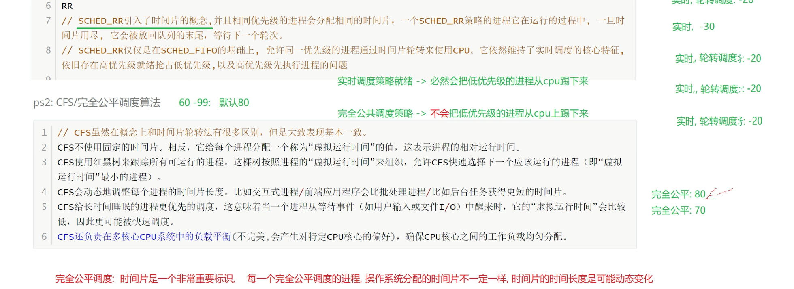

# 1、linux

## 1.1管道

什么是管道

管道（pipe）是Unix/Linux中最古老的进程间通信方式之一，本质上是内核维护的一块环形缓冲区。它通过文件描述符暴露给进程，一端用于写入数据，另一端用于读取数据，数据按先进先出（FIFO）的顺序流经管道。

管道的特点：

- **单向流动**：数据只能从写端流向读端
- **字节流模型**：没有消息边界，由内核自动管理数据流
- **自带同步**：读空管道时阻塞，写满管道时也阻塞
- **引用计数**：只有当所有写端都关闭后，读端读取才会返回EOF

管道在shell中广泛使用，例如 `ls -l | grep "\.txt"` 就将前一个命令的标准输出通过管道连接到后一个命令的标准输入。

管道的作用

1. **进程间数据传输**：将一个进程的输出数据传递给另一个进程，常见于shell管道命令
2. **同步机制**：管道的阻塞特性天然实现了生产者-消费者模型的同步——读端无数据时阻塞等待，写端缓冲区满时阻塞等待
3. **简化编程模型**：以文件描述符形式呈现，进程可以用熟悉的read/write接口操作，无需学习复杂的IPC API
4. **流式数据处理**：适合处理流式数据，如日志处理、数据过滤等场景，数据边产生边消费，不需要全部放入内存
5. **解耦进程**：通信双方只需关注管道两端，无需知道对方的存在或状态

### 1.1.2进程间通信

进程间通信（IPC）指在不同进程之间传递数据或信号的机制。Linux中常见的IPC方式有：管道（pipe）、消息队列（message queue）、共享内存（shared memory）、信号量（semaphore）、信号（signal）、套接字（socket）等。

### 1.1.3什么是进程

进程是程序的一次执行过程，是操作系统进行资源分配和调度的基本单位。每个进程有独立的地址空间、数据栈和其他辅助数据。

### 1.1.4管道的分类

管道按使用范围分为两类：无名管道和有名管道。

#### 1.1.4.1有名管道

有名管道（FIFO，First In First Out）以文件形式存在于文件系统中，通过`mkfifo`命令或`mkfifo()`系统调用创建。

**核心特点**：

- 在文件系统中有可见的路径名，通过`ls -l`可查看，类型标识为`p`
- 不相关的进程可以通过文件名打开该管道进行通信，即使没有亲缘关系也可以使用
- 遵循先入先出的原则，数据以字节流形式读写
- 使用前必须先打开（open），打开时可能阻塞（默认情况下，读端打开会阻塞直到写端打开，反之亦然）
- 内核会为FIFO维护一个inode对象，但数据不存储在磁盘上

**使用方式**：

```bash
# shell中创建和使用有名管道
mkfifo mypipe
echo "hello" > mypipe   # 写端，会阻塞直到有读端打开
cat mypipe              # 读端
```

**适用场景**：无亲缘关系的进程间通信、客户端-服务端模式的简单数据交换。

#### 1.1.4.2无名管道

无名管道（anonymous pipe）由`pipe()`系统调用创建，没有文件名，只存在于内核中，通过进程打开的文件描述符来访问。

**核心特点**：

- 没有文件系统路径，只能通过继承的文件描述符访问
- 只能在具有亲缘关系（如父子进程、兄弟进程）的进程之间使用
- 通过`fork()`或`exec()`继承文件描述符来传递通信能力
- `pipe(int fd[2])`调用返回两个文件描述符：`fd[0]`为读端，`fd[1]`为写端
- 生命周期由内核管理，当所有文件描述符关闭时管道自动销毁

**使用模式**：

```c
int fd[2];
pipe(fd);        // 创建管道
pid_t pid = fork();
if (pid == 0) {  // 子进程
    close(fd[1]); // 关闭不需要的写端
    read(fd[0], ...);
} else {         // 父进程
    close(fd[0]); // 关闭不需要的读端
    write(fd[1], ...);
}
```

**适用场景**：父子进程间的简单数据传递，shell命令行中的`|`操作符底层就是通过无名管道实现的。

**关键区别对比**：

| 特性 | 无名管道 | 有名管道 |
| ------ | --------- | --------- |
| 文件系统可见 | 否 | 是 |
| 亲缘关系要求 | 必须有 | 无要求 |
| 创建方式 | `pipe()` | `mkfifo()` |
| 打开方式 | 自动创建 | 需手动`open()` |
| 销毁方式 | fd关闭后自动销毁 | 需手动`unlink` |
| shell操作符 | `\|` | 无直接操作符 |

### 1.1.5使用管道做半双工通信

#### 1.1.5.1代码实现

```c
#include <stdio.h>
#include <unistd.h>
#include <string.h>

int main() {
    int fd[2];
    pid_t pid;
    char buf[100];

    if (pipe(fd) == -1) {
        perror("pipe");
        return 1;
    }

    pid = fork();
    if (pid == 0) {
        // 子进程：写数据
        close(fd[0]); // 关闭读端
        char *msg = "Hello from child";
        write(fd[1], msg, strlen(msg) + 1);
        close(fd[1]);
    } else if (pid > 0) {
        // 父进程：读数据
        close(fd[1]); // 关闭写端
        read(fd[0], buf, sizeof(buf));
        printf("Parent received: %s\n", buf);
        close(fd[0]);
    }
    return 0;
}
```

#### 1.1.5.2缺点

1. 管道默认是半双工的，数据只能单向流动，若要双向通信需要创建两个管道
2. 管道中的数据是字节流，没有消息边界，需要应用层自行解析
3. 管道的缓冲区大小有限（通常为65536字节，可通过`fcntl`调整），写入超过容量会阻塞
4. 只能用于具有亲缘关系的进程之间（无名管道），或有名管道需在文件系统中有路径

## 1.2 IO多路复用

### 1.2.1 什么是IO多路复用

IO多路复用是一种同步IO模型，允许单个进程同时监视多个文件描述符，当其中任意一个文件描述符准备好IO操作时通知进程进行处理。Linux中实现IO多路复用的系统调用主要有`select`、`poll`和`epoll`。

### 1.2.3 为什么用IO多路复用，它解决了什么问题

解决传统多进程/多线程模型下，每个连接需要占用一个进程/线程的问题，避免了大量连接时的资源消耗和上下文切换开销。IO多路复用用一个线程即可管理数千个连接，提高了系统的并发处理能力。

### 1.2.4 select IO多路复用的代码示例

select接口使用步骤

```c
#include <stdio.h>
#include <fcntl.h>
#include <unistd.h>
#include <string.h>
#include <sys/time.h>
#include <sys/select.h>
#include <sys/types.h>

int main()
{
    int write_pipe = open("1.pipe", O_WRONLY);
    int read_pipe  = open("2.pipe", O_RDONLY);

    fd_set set;        // fd_set位图结构，用于存放待监听的文件描述符
    char   buf[60];

    while(1) {
        // 步骤1：清空buf和监听集合（用户态操作）
        bzero(&buf, sizeof(buf));
        FD_ZERO(&set);

        // 步骤2：将需要监听的文件描述符加入集合（用户态操作，修改set位图）
        FD_SET(read_pipe, &set);
        FD_SET(STDIN_FILENO, &set);

        /*
         * 步骤3：调用select，触发系统调用，进入内核态
         *   a) 内核将fd_set从用户态空间拷贝到内核态空间（copy_from_user）
         *   b) 内核遍历（轮询）所有被监听的文件描述符，检查每个fd的数据就绪状态
         *   c) 若无任何fd就绪，进程休眠，主动让出CPU，等待事件唤醒
         *   d) 当有fd就绪或发生错误时，内核修改fd_set（只保留就绪的fd标记）
         *   e) 将修改后的fd_set从内核态拷贝回用户态空间（copy_to_user）
         *   f) 返回就绪的文件描述符数量（或超时返回0，错误返回-1）
         *     整个过程完成了 用户态→内核态→用户态 的两次上下文切换
         */
        int ret = select(10, &set, NULL, NULL, NULL);
        if(ret == -1) {
            break;
        }

        // 步骤4：select返回后，已回到用户态，使用FD_ISSET遍历检查哪些fd就绪
        if(FD_ISSET(STDIN_FILENO, &set)) {
            int ret = read(STDIN_FILENO, buf, sizeof(buf));
            if(ret == -1) {
                break;
            }
            write(write_pipe, buf, sizeof(buf));
        }

        if(FD_ISSET(read_pipe, &set)) {
            int ret = read(read_pipe, buf, sizeof(buf));
            if(ret == -1) {
                break;
            }
            printf("b:%s", buf);
        }
    }
    close(write_pipe);
    close(read_pipe);
}
```

### 1.2.5 select的缺陷

1. **文件描述符数量限制**：`select`使用位图存储文件描述符，受`FD_SETSIZE`限制（通常为1024），无法处理大量连接
2. **重复传递集合**：每次调用`select`都需要将`fd_set`从用户态拷贝到内核态，性能开销大
3. **线性扫描**：内核需要遍历所有文件描述符来检查哪些就绪，O(n)复杂度
4. **修改集合**：`select`会修改传入的`fd_set`，每次调用前需要重新设置
5. **返回后仍需遍历**：返回后用户程序需要遍历所有文件描述符调用`FD_ISSET`来找出就绪的描述符

### 1.2.6 select轮询深入理解

**问：select轮询是什么概念？考虑下面的场景：当前有两个文件描述符就绪，在内核轮询的过程中检查到了第一个就绪的文件描述符，那么内核是否还需要继续完整的轮询完后面的文件描述符，如果会继续轮询后面的文件描述符，那么内核会识别到两个就绪的文件描述符。如果轮询是说遇到一个就绪之后就结束轮询，返回当前的就绪文件描述符，那么一次轮询一定只能返回一个就绪的文件描述符。这种场景中哪个是正确的？**

答：内核会完整轮询完所有被监听的文件描述符，不会在遇到第一个就绪的 fd 后就停止。select 的返回值是**就绪的文件描述符总数**，这意味着它一次调用可以返回多个就绪的 fd。内核的实现逻辑是：

1. 遍历 `[0, maxfd)` 范围内所有被 `FD_SET` 标记的 fd
2. 对每个 fd 调用其对应的 `poll` 方法检查是否就绪
3. **全部遍历完后**，统计总共发现了多少个就绪的 fd
4. 修改 fd_set，只保留那些就绪的 fd 的标记位
5. 返回就绪总数

| 场景 | 是否正确 |
| ------ | --------- |
| 遇到第一个就绪就结束 → 一次只返回一个 | ❌ 错误 |
| 持续轮询完所有 fd → 可返回多个就绪 | ✅ 正确 |

这也正是 select 的性能问题之一。虽然一次能返回多个就绪 fd 是好事，但**每次调用 select 都要完整扫描所有 fd**（即使只有少量 fd 在被监听），这是 O(n) 的线性开销。`epoll` 相比 `select` 的核心改进之一就是通过回调机制避免了这种无差别遍历——它只返回真正就绪的 fd，不需要扫描全集。

```text
select:  扫描全部 n 个 fd → 找出就绪的 k 个 → 返回
epoll:   只返回就绪的 k 个 fd（通过回调注册，O(1)）
```

所以回到问题：**select 会完整轮询完所有 fd，然后一次性返回所有就绪的 fd 的总数**。用户态再用 `FD_ISSET` 逐个判断哪些 fd 就绪了。

**问：意思是说，检测文件描述符就绪后返回是在内核做的，而轮询是哪个文件描述符是在用户态做的吗？**

答：不是的，**轮询所有文件描述符也是在 内核态 做的**，整个流程都在内核中完成。

完整流程澄清：

```text
用户态                      内核态
─────────                  ─────────
FD_ZERO / FD_SET  ──调用select──→  ① copy_from_user 将fd_set拷入内核
                                   ② 遍历所有被监听的fd，逐个检查就绪状态  ← 轮询在这里
                                   ③ 修改fd_set，只保留就绪的fd标记
                                   ④ copy_to_user 将修改后的fd_set拷回用户态
                                  ←──返回就绪总数──
FD_ISSET 逐个判断
哪个fd就绪了
```

**关键点**：

- **步骤②（轮询遍历所有fd）**：发生在内核态，内核会完整扫一遍全部被监听的 fd
- **步骤④之后（FD_ISSET）**：发生在用户态，此时内核已经把结果（哪些 fd 就绪）写在了 fd_set 里，用户态只需要用 `FD_ISSET` 读取即可

所以轮询检查所有 fd 的就绪状态是由内核完成的，不是用户态做的。用户态做的只是拿着内核处理好的结果（已标记就绪的 fd_set），用 `FD_ISSET` 找出具体是哪个 fd 就绪了。

### select的最后一个参数如何使用

群聊超时踢出代码

### 进程通信传输数据如何保证有序

使用协议，传输 头部+数据

代码示例：

## 1.3 linux 进程

### 进程

### 内存 虚拟内存

### cpu 虚拟cpu

### 进程调度算法



### 常用进程相关指令

### fork创建进程

进程的特点，解耦

#### 父子进程号关系

代码示例

#### 写时复制

#### 打开文件前fork和打开文件后fork的区别

先fork会共享文件描述符偏移量 导致写文件时不会覆盖数据
后fork不会共享文件描述符偏移量 导致写文件时数据被覆盖（覆盖的顺序会因调度问题而随机）

代码示例

```c

```

#### exec函数
