# 1、linux

## 1.1管道
  
什么是管道

管道（pipe）是Unix/Linux进程间通信方式，本质上是内核维护的一块环形缓冲区。它通过文件描述符暴露给进程，一端用于写入数据，另一端用于读取数据，数据按先进先出（FIFO）的顺序流经管道。

管道的特点：

- **单向流动**：数据只能从写端流向读端
- **字节流模型**：没有消息边界，由内核自动管理数据流
- **自带同步**：读空管道时阻塞，写满管道时也阻塞
- **引用计数**：只有当所有写端都关闭后，读端读取才会返回EOF

管道在shell中广泛使用，例如 `ls -l | grep "\.txt"` 就将前一个命令的标准输出通过管道连接到后一个命令的标准输入。

管道的作用

1. **进程间数据传输**：将一个进程的输出数据传递给另一个进程，常见于shell管道命令
2. **同步机制**：管道的阻塞特性天然实现了生产者-消费者模型的同步——读端无数据时阻塞等待，写端缓冲区满时阻塞等待
3. **简化编程模型**：以文件描述符形式呈现，进程可以用熟悉的read/write接口操作，无需学习复杂的IPC API
4. **流式数据处理**：适合处理流式数据，如日志处理、数据过滤等场景，数据边产生边消费，不需要全部放入内存
5. **解耦进程**：通信双方只需关注管道两端，无需知道对方的存在或状态

### 1.1.2进程间通信

进程间通信（IPC）指在不同进程之间传递数据或信号的机制。Linux中常见的IPC方式有：管道（pipe）、消息队列（message queue）、共享内存（shared memory）、信号量（semaphore）、信号（signal）、套接字（socket）等。

### 1.1.3什么是进程

进程是程序的一次执行过程，是操作系统进行资源分配和调度的基本单位。每个进程有独立的地址空间、数据栈和其他辅助数据。

### 1.1.4管道的分类

管道按使用范围分为两类：无名管道和有名管道。

#### 1.1.4.1有名管道

有名管道（FIFO，First In First  Out）以文件形式存在于文件系统中，通过`mkfifo`命令或`mkfifo()`系统调用创建。

**核心特点**：

- 在文件系统中有可见的路径名，通过`ls -l`可查看，类型标识为`p`
- 不相关的进程可以通过文件名打开该管道进行通信，即使没有亲缘关系也可以使用
- 遵循先入先出的原则，数据以字节流形式读写
- 使用前必须先打开（open），打开时可能阻塞（默认情况下，读端打开会阻塞直到写端打开，反之亦然）
- 内核会为FIFO维护一个inode对象，但数据不存储在磁盘上

**使用方式**：

```bash
# shell中创建和使用有名管道
mkfifo mypipe
echo "hello" > mypipe   # 写端，会阻塞直到有读端打开
cat mypipe              # 读端
```

**适用场景**：无亲缘关系的进程间通信、客户端-服务端模式的简单数据交换。

#### 1.1.4.2无名管道

无名管道（anonymous pipe）由`pipe()`系统调用创建，没有文件名，只存在于内核中，通过进程打开的文件描述符来访问。

**核心特点**：

- 没有文件系统路径，只能通过继承的文件描述符访问
- 只能在具有亲缘关系（如父子进程、兄弟进程）的进程之间使用
- 通过`fork()`或`exec()`继承文件描述符来传递通信能力
- `pipe(int fd[2])`调用返回两个文件描述符：`fd[0]`为读端，`fd[1]`为写端
- 生命周期由内核管理，当所有文件描述符关闭时管道自动销毁

**使用模式**：

```c
int fd[2];
pipe(fd);        // 创建管道
pid_t pid = fork();
if (pid == 0) {  // 子进程
    close(fd[1]); // 关闭不需要的写端
    read(fd[0], ...);
} else {         // 父进程
    close(fd[0]); // 关闭不需要的读端
    write(fd[1], ...);
}
```

**适用场景**：父子进程间的简单数据传递，shell命令行中的`|`操作符底层就是通过无名管道实现的。

**关键区别对比**：

| 特性 | 无名管道 | 有名管道 |
| ------ | --------- | --------- |
| 文件系统可见 | 否 | 是 |
| 亲缘关系要求 | 必须有 | 无要求 |
| 创建方式 | `pipe()` | `mkfifo()` |
| 打开方式 | 自动创建 | 需手动`open()` |
| 销毁方式 | fd关闭后自动销毁 | 需手动`unlink` |
| shell操作符 | `\|` | 无直接操作符 |

### 1.1.5使用管道做半双工通信

#### 1.1.5.1代码实现

```c
#include <stdio.h>
#include <unistd.h>
#include <string.h>

int main() {
    int fd[2];
    pid_t pid;
    char buf[100];

    if (pipe(fd) == -1) {
        perror("pipe");
        return 1;
    }

    pid = fork();
    if (pid == 0) {
        // 子进程：写数据
        close(fd[0]); // 关闭读端
        char *msg = "Hello from child";
        write(fd[1], msg, strlen(msg) + 1);
        close(fd[1]);
    } else if (pid > 0) {
        // 父进程：读数据
        close(fd[1]); // 关闭写端
        read(fd[0], buf, sizeof(buf));
        printf("Parent received: %s\n", buf);
        close(fd[0]);
    }
    return 0;
}
```

#### 1.1.5.2缺点

1. 管道默认是半双工的，数据只能单向流动，若要双向通信需要创建两个管道
2. 管道中的数据是字节流，没有消息边界，需要应用层自行解析
3. 管道的缓冲区大小有限（通常为65536字节，可通过`fcntl`调整），写入超过容量会阻塞
4. 只能用于具有亲缘关系的进程之间（无名管道），或有名管道需在文件系统中有路径

## 1.2 IO多路复用

### 1.2.1 什么是IO多路复用

IO多路复用是一种同步IO模型，允许单个进程同时监视多个文件描述符，当其中任意一个文件描述符准备好IO操作时通知进程进行处理。Linux中实现IO多路复用的系统调用主要有`select`、`poll`和`epoll`。

### 1.2.3 为什么用IO多路复用，它解决了什么问题

解决传统多进程/多线程模型下，每个连接需要占用一个进程/线程的问题，避免了大量连接时的资源消耗和上下文切换开销。IO多路复用用一个线程即可管理数千个连接，提高了系统的并发处理能力。

### 1.2.4 select IO多路复用的代码示例

select接口使用步骤

```c
#include <stdio.h>
#include <fcntl.h>
#include <unistd.h>
#include <string.h>
#include <sys/time.h>
#include <sys/select.h>
#include <sys/types.h>

int main()
{
    int write_pipe = open("1.pipe", O_WRONLY);
    int read_pipe  = open("2.pipe", O_RDONLY);

    fd_set set;        // fd_set位图结构，用于存放待监听的文件描述符
    char   buf[60];

    while(1) {
        // 步骤1：清空buf和监听集合（用户态操作）
        bzero(&buf, sizeof(buf));
        FD_ZERO(&set);

        // 步骤2：将需要监听的文件描述符加入集合（用户态操作，修改set位图）
        FD_SET(read_pipe, &set);
        FD_SET(STDIN_FILENO, &set);

        /*
         * 步骤3：调用select，触发系统调用，进入内核态
         *   a) 内核将fd_set从用户态空间拷贝到内核态空间（copy_from_user）
         *   b) 内核遍历（轮询）所有被监听的文件描述符，检查每个fd的数据就绪状态
         *   c) 若无任何fd就绪，进程休眠，主动让出CPU，等待事件唤醒
         *   d) 当有fd就绪或发生错误时，内核修改fd_set（只保留就绪的fd标记）
         *   e) 将修改后的fd_set从内核态拷贝回用户态空间（copy_to_user）
         *   f) 返回就绪的文件描述符数量（或超时返回0，错误返回-1）
         *     整个过程完成了 用户态→内核态→用户态 的两次上下文切换
         */
        int ret = select(10, &set, NULL, NULL, NULL);
        if(ret == -1) {
            break;
        }

        // 步骤4：select返回后，已回到用户态，使用FD_ISSET遍历检查哪些fd就绪
        if(FD_ISSET(STDIN_FILENO, &set)) {
            int ret = read(STDIN_FILENO, buf, sizeof(buf));
            if(ret == -1) {
                break;
            }
            write(write_pipe, buf, sizeof(buf));
        }

        if(FD_ISSET(read_pipe, &set)) {
            int ret = read(read_pipe, buf, sizeof(buf));
            if(ret == -1) {
                break;
            }
            printf("b:%s", buf);
        }
    }
    close(write_pipe);
    close(read_pipe);
}
```

### 1.2.5 select的缺陷

1. **文件描述符数量限制**：`select`使用位图存储文件描述符，受`FD_SETSIZE`限制（通常为1024），无法处理大量连接
2. **重复传递集合**：每次调用`select`都需要将`fd_set`从用户态拷贝到内核态，性能开销大
3. **线性扫描**：内核需要遍历所有文件描述符来检查哪些就绪，O(n)复杂度
4. **修改集合**：`select`会修改传入的`fd_set`，每次调用前需要重新设置
5. **返回后仍需遍历**：返回后用户程序需要遍历所有文件描述符调用`FD_ISSET`来找出就绪的描述符

### 1.2.6 select轮询深入理解

**问：select轮询是什么概念？考虑下面的场景：当前有两个文件描述符就绪，在内核轮询的过程中检查到了第一个就绪的文件描述符，那么内核是否还需要继续完整的轮询完后面的文件描述符，如果会继续轮询后面的文件描述符，那么内核会识别到两个就绪的文件描述符。如果轮询是说遇到一个就绪之后就结束轮询，返回当前的就绪文件描述符，那么一次轮询一定只能返回一个就绪的文件描述符。这种场景中哪个是正确的？**

答：内核会完整轮询完所有被监听的文件描述符，不会在遇到第一个就绪的 fd 后就停止。select 的返回值是**就绪的文件描述符总数**，这意味着它一次调用可以返回多个就绪的 fd。内核的实现逻辑是：

1. 遍历 `[0, maxfd)` 范围内所有被 `FD_SET` 标记的 fd
2. 对每个 fd 调用其对应的 `poll` 方法检查是否就绪
3. **全部遍历完后**，统计总共发现了多少个就绪的 fd
4. 修改 fd_set，只保留那些就绪的 fd 的标记位
5. 返回就绪总数

| 场景 | 是否正确 |
| ------ | --------- |
| 遇到第一个就绪就结束 → 一次只返回一个 | ❌ 错误 |
| 持续轮询完所有 fd → 可返回多个就绪 | ✅ 正确 |

这也正是 select 的性能问题之一。虽然一次能返回多个就绪 fd 是好事，但**每次调用 select 都要完整扫描所有 fd**（即使只有少量 fd 在被监听），这是 O(n) 的线性开销。`epoll` 相比 `select` 的核心改进之一就是通过回调机制避免了这种无差别遍历——它只返回真正就绪的 fd，不需要扫描全集。

```text
select:  扫描全部 n 个 fd → 找出就绪的 k 个 → 返回
epoll:   只返回就绪的 k 个 fd（通过回调注册，O(1)）
```

所以回到问题：**select 会完整轮询完所有 fd，然后一次性返回所有就绪的 fd 的总数**。用户态再用 `FD_ISSET` 逐个判断哪些 fd 就绪了。

**问：意思是说，检测文件描述符就绪后返回是在内核做的，而轮询是哪个文件描述符是在用户态做的吗？**

答：不是的，**轮询所有文件描述符也是在 内核态 做的**，整个流程都在内核中完成。

完整流程澄清：

```text
用户态                      内核态
─────────                  ─────────
FD_ZERO / FD_SET  ──调用select──→  ① copy_from_user 将fd_set拷入内核
                                   ② 遍历所有被监听的fd，逐个检查就绪状态  ← 轮询在这里
                                   ③ 修改fd_set，只保留就绪的fd标记
                                   ④ copy_to_user 将修改后的fd_set拷回用户态
                                  ←──返回就绪总数──
FD_ISSET 逐个判断
哪个fd就绪了
```

**关键点**：

- **步骤②（轮询遍历所有fd）**：发生在内核态，内核会完整扫一遍全部被监听的 fd
- **步骤④之后（FD_ISSET）**：发生在用户态，此时内核已经把结果（哪些 fd 就绪）写在了 fd_set 里，用户态只需要用 `FD_ISSET` 读取即可

所以轮询检查所有 fd 的就绪状态是由内核完成的，不是用户态做的。用户态做的只是拿着内核处理好的结果（已标记就绪的 fd_set），用 `FD_ISSET` 找出具体是哪个 fd 就绪了。

### 1.2.7 select的最后一个参数如何使用

群聊超时踢出代码

```c
int main(int argc,char*argv[])
{
   int fd_write = open("1.pipe", O_WRONLY);
   int fd_read = open("2.pipe", O_RDONLY);
   char buf[60];

   fd_set set;

   // 记录a发过来信息的时间
   time_t tag_a_msg = time(NULL);
   // 记录当前时间
   time_t tag_cur = time(NULL);

   while(1){
       FD_ZERO(&set);
       FD_SET(STDIN_FILENO, &set);
       FD_SET(fd_read, &set);

       // 每1秒就绪一次
       struct timeval time_val;
       time_val.tv_sec = 1;
       time_val.tv_usec = 0;
       int res_select = select(10, &set, NULL,NULL, &time_val);
       // 更新当前时间
       tag_cur = time(NULL);

       if(FD_ISSET(fd_read, &set)){
           bzero(buf, sizeof(buf));
           int read_num = read(fd_read, buf, sizeof(buf));
           if(read_num == 0){
               printf("对方断开链接 \n");
               break;
           }
           printf("UserA: %s", buf);
           // 更新a的发送信息时间
           tag_a_msg = time(NULL);
       }
       if(FD_ISSET(STDIN_FILENO, &set)){
           bzero(buf, sizeof(buf));
           int read_stdin = read(STDIN_FILENO, buf, sizeof(buf));
           if(read_stdin == 0){
               // 用户按下ctrl+d; 输入文件终止符; 终止标准输入; read返回0
               break;
           }
           write(fd_write, buf, sizeof(buf));
       }
       // 比较信息时间和当前时间
       if(tag_cur - tag_a_msg >= 10){
           printf("10秒未发信息 \n");
           break;
       }
   }
   close(fd_write);
   close(fd_read);
   return 0;
}

```

### 1.2.8 进程通信传输数据如何保证有序

使用协议，传输 头部+数据

代码示例：

transmit.cpp

```c
#include <stdio.h>   // FILE, stdin/stdout/stderr, fgets, printf, perror, fflush
#include <string.h>  // strlen, strchr, strcpy, memset 等字符串操作
#include <unistd.h>  // read, write, close, STDIN_FILENO 等POSIX系统调用
#include <fcntl.h>   // open, O_RDONLY/O_WRONLY/O_RDWR 等文件控制宏
#include <stdlib.h>  // exit, malloc, free, atoi 等通用工具函数

int main(){
    // open - 打开文件/管道，返回文件描述符
    // 原型: int open(const char *pathname, int flags);
    // flags: O_RDONLY(只读) O_WRONLY(只写) O_RDWR(读写)
    // 返回值: 成功返回>=0的文件描述符，失败返回-1并设置errno
    int wfd = open("1.pipe", O_WRONLY);
    if (wfd == -1) {
        // perror - 打印errno对应的错误信息到stderr
        // 原型: void perror(const char *s);
        // 输出: "s: 错误描述"
        perror("open");
        return 1;
    }

    char buf[4096];
    while(1){
        //获取STDIN_FILENO 标准输入的数据
        //以换行为边界
        // fgets - 从文件流中读取一行（遇到换行或EOF停止）
        // 原型: char *fgets(char *s, int size, FILE *stream);
        // 参数: s(缓冲区) size(缓冲区大小) stream(文件流)
        // 特点: 会自动在末尾加'\0'，最多读 size-1 个字符
        // 返回值: 成功返回s，失败或到达文件尾返回NULL
        if (fgets(buf, sizeof(buf), stdin) == NULL) {
            break;
        }

        // strlen - 计算字符串长度（不含结尾'\0'）
        // 原型: size_t strlen(const char *s);
        // 返回值: 字符串的字节数
        int len = strlen(buf);

        // write - 向文件描述符写入指定字节数
        // 原型: ssize_t write(int fd, const void *buf, size_t count);
        // 返回值: 成功返回写入的字节数，失败返回-1
        // 注意: 管道/PIPE默认最大写入PIPE_BUF字节（通常4096），不能保证一次写完所有数据
        //发送字符串长度
        write(wfd, &len, sizeof(len));

        //发送字符串
        write(wfd, buf, len);
    }

    // close - 关闭文件描述符
    // 原型: int close(int fd);
    // 返回值: 成功返回0，失败返回-1
    // 关闭后fd不再可用，管道读端读到0表示写端已关闭
    close(wfd);
    return 0;
}

```

receive.cpp

```c
#include <stdio.h>   // FILE, stdin/stdout/stderr, fgets, printf, perror, fflush
#include <string.h>  // strlen, strchr, strcpy, memset 等字符串操作
#include <unistd.h>  // read, write, close, STDIN_FILENO 等POSIX系统调用
#include <fcntl.h>   // open, O_RDONLY/O_WRONLY/O_RDWR 等文件控制宏
#include <stdlib.h>  // exit, malloc, free, atoi 等通用工具函数

int main(){
    // open - 打开文件/管道，返回文件描述符
    // 原型: int open(const char *pathname, int flags);
    // flags: O_RDONLY(只读) O_WRONLY(只写) O_RDWR(读写)
    // 返回值: 成功返回>=0的文件描述符，失败返回-1并设置errno
    int rfd = open("1.pipe", O_RDONLY);
    if (rfd == -1) {
        // perror - 打印errno对应的错误信息到stderr
        // 原型: void perror(const char *s);
        perror("open");
        return 1;
    }

    char buf[4096];
    int len;
    while(1){
        // read - 从文件描述符读取指定字节数
        // 原型: ssize_t read(int fd, void *buf, size_t count);
        // 返回值: >0 实际读到的字节数, =0 读到文件尾(管道写端关闭), -1 出错
        // 注意: read不保证一次读完count字节，需循环读取直到收满
        //先读长度
        ssize_t n = read(rfd, &len, sizeof(len));
        if (n <= 0) {
            break;
        }

        //再读数据
        ssize_t total = 0;
        while (total < len) {
            ssize_t ret = read(rfd, buf + total, len - total);
            if (ret <= 0) {
                break;
            }
            total += ret;
        }

        buf[total] = '\0';
        // printf - 格式化输出到stdout
        // 原型: int printf(const char *format, ...);
        // 返回值: 成功返回输出的字符数，失败返回负数
        printf("%s", buf);
        // fflush - 刷新文件流缓冲区，强制输出
        // 原型: int fflush(FILE *stream);
        // 返回值: 成功返回0，失败返回EOF
        fflush(stdout);
    }

    // close - 关闭文件描述符
    // 原型: int close(int fd);
    // 关闭后fd不再可用，管道写端收到SIGPIPE或写入返回-1
    close(rfd);
    return 0;
}
```

## 1.3 linux 进程

### 1.3.1 进程

#### 1.3.1.1 操作系统背景

> 批处理系统将任务批量提交执行，但IO等待导致CPU频繁空闲。多道程序设计将内存分区，任务交替使用CPU以提高利用率。分时系统为每个任务分配CPU时间片，保证交互响应速度。进程是上述机制能够运转的核心抽象。

进程存在的意义：
>解耦
>
>无论是什么操作系统，他们的本质思想就是把`任务\程序` 并发执行，共享cpu和其他计算机资源
>
>为了实现这种技术，操作系统把每个执行的程序`抽象为`一个进程，**每个进程在逻辑上独占cpu和内存资源**,而操作系统的作用就是为进程分配和调度`真实且复杂`的物理资源。
>
>结果：这使得每个进程能互不干扰地在同一个操作系统上运行。而作为开发者，我们不用关心操作系统如何管理分配物理资源的，我们在写程序代码时看到的也是进程逻辑上的属性。

#### 1.3.1.2 进程的定义

>**用户角度**进程是一个程序`动态执行的过程`。是静态的程序文件被加载到内存、分配资源、执行、调度和消亡的过程。
>**操作系统角度**进程是`资源分配的基本单位`。进程需要占用cpu资源执行程序、需要占用存储资源来保存状态。进程需要保存的内容包括`数据段、代码段、堆、栈`以及`其他内存空间`，进程也需要占用资源管理打开的文件、挂起的信号、内核内部数据、处理器状态、存在内存映射的内存空间以及执行线程，而执行线程的信息则包含程序计数器、栈和寄存器状态。
>
>总结：进程，就是处于执行期的程序和相关资源的总称。

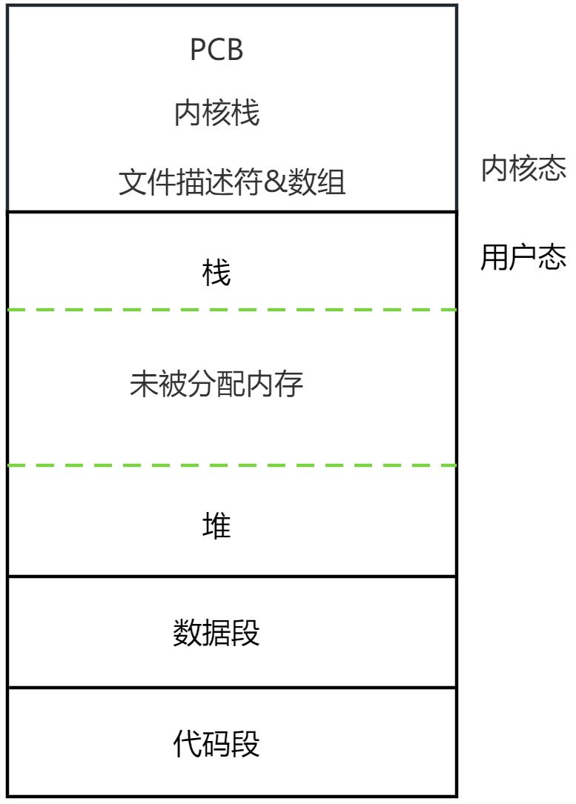
>代码段：这部分内存存储了进程要执行的编译后的代码。
>数据段：数据段存储了程序的全局变量和静态变量。
>堆（Heap）：堆是用于动态内存分配的内存区域。
>栈（Stack）：栈用于存储函数调用时的临时数据，如参数、返回地址和局部变量。

#### 1.3.1.3 进程的内存结构

- 进程模式

> 进程分为**用户态**和**内核态**两种运行模式：
> **用户态**：执行应用程序代码，无权限直接访问硬件或执行敏感操作，需通过系统调用切换到内核态。
> **内核态**：执行操作系统内核代码，有权执行任何CPU指令和访问任意内存地址，处理完系统调用后切回用户态。
>
> 进程生命周期中会因系统调用在两者间多次切换，以此保障系统安全性与稳定性。

- 用户态空间和内核态空间

> 新进程创建时，操作系统分配两种空间：
> **用户态空间**：独立的虚拟地址空间（代码段、数据段、堆、栈），进程间隔离，不能互访。
> **内核态空间**：包含PCB（进程控制块，记录状态/寄存器/内存信息等）、内核栈（处理系统调用/中断/切换）、文件描述符表等。
>
> 操作系统通过内存保护机制确保进程只能访问自身用户态空间，仅在内核态下才授予底层操作权限，完成后立即切回用户态。

#### 1.3.1.4 内存 虚拟内存

**每个进程还从逻辑上还独占一片连续的内存空间(当然是虚拟的), 我们称为为`虚拟内存`。**

>虚拟内存通过虚拟映射的方式(`按照某种关系把虚拟地址和物理地址相互映射`), 从逻辑上为每个进程提供了一个地址连续的、独立使用的内存空间,   这解决了计算实际内存具有大小局限性的问题(`如果虚拟地址经过转化之后在真实内存中未命中, 则需要空闲页框加载磁盘数据, 或者当前内存已满/无空闲页框, 则进行页的置换`, `这样, 借用硬盘空间作为额外的容器, 以及内存的置换能力,打破了真实内存的限制, 拓展了逻辑上内存的大小`);  于此同时`虚拟内存机制`为每个进程提供了一个独立的地址空间(虚拟的)，从而逻辑上隔离了不同进程的内存空间。这样，进程间的内存隔离和解耦，增加了操作系统的稳定性和安全性。

#### 1.3.1.5 cpu 虚拟cpu

>利用进程机制，所有的现代操作系统都支持在同一个`时间段`来完成多个任务。尽管某个时刻，真实的CPU只能运行一个进程，但是从进程自己的角度来看，它会认为自己在独享CPU(即虚拟CPU)，而从用户的角度来看多个进程在一段时间内是同时执行的，即并发执行。在实际的实现中，操作系统会使用调度器来分配CPU资源，这对用户是透明的，由于计算机执行这些过程非常快，以至于用户看上去是多个程序在同时运行。

```txt
>并发: 在某一段时间内, 多个进程同时运行。
>并行: 在某一时刻, 多个进程同时运行。
```

#### 1.3.1.6 进程调度算法

进程优先级 -40（优先级高） ~ 99 （优先级低）
>实时调度策略 -> 必然把优先级低的进程 踢下cpu
>
>完全公平调度 -> `不会`把优先级低的进程提下cpu.
>时间片是公平调度的重要指标，每个完全公平调度的进程，操作系统分配的时间片不一定一样，时间片长度可能动态变化。


#### 1.3.1.7 常用进程相关指令

kill

### 1.3.2 fork创建进程

进程的特点，解耦

#### 1.3.2.1 父子进程号关系

代码示例

```c
#include <stdio.h>
#include <sys/wait.h>

int main()
{
    int pid = fork();
    if(pid == 0) {
        printf("son:%d, father:%d\n", getpid(), getppid());
    } else {
        printf("son:%d, myself:%d\n", pid, getpid());
    }
    return 0;
}
```

#### 1.3.2.2 内存复制

> fork()创建一个与当前进程**几乎一致的用户态地址空间**，父进程的内存布局（上下文、变量、堆栈、代码等）被复制给子进程。
>
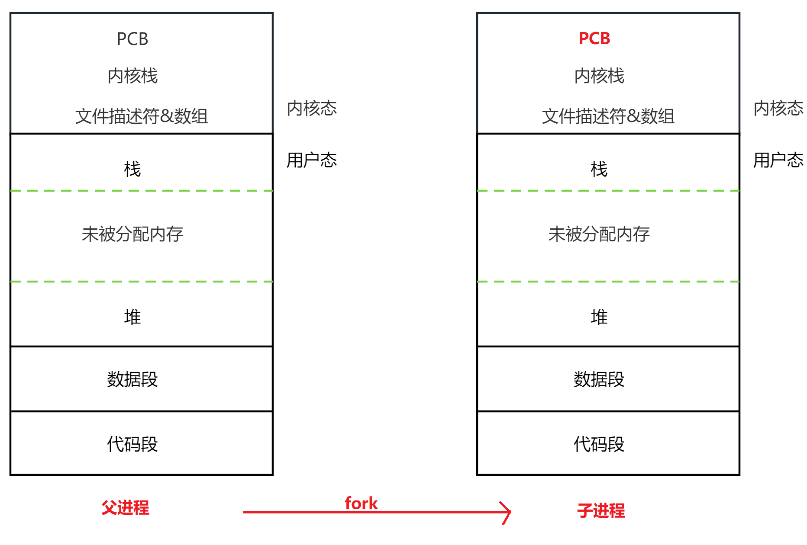

>
> 尽管子进程是父进程的副本，但部分属性（主要是PCB）需修改以保证独立性：
> **PID**：子进程获得唯一PID
> **PPID**：子进程PPID设为父进程PID

#### 1.3.2.3 写时复制

> fork()时，OS不立即复制父进程的全部内存，而是让父子进程**共享相同的物理内存页**并标记为**只读**。当任一进程尝试写入某页时触发缺页异常，OS为写入方**分配新物理页并拷贝数据**。此即写时复制(Copy-On-Write, COW)。只在真正写入时才复制，减少内存使用，提高fork效率。

#### 1.3.2.4 打开文件前fork和打开文件后fork的区别

先fork会共享文件描述符偏移量 导致写文件时不会覆盖数据
后fork不会共享文件描述符偏移量 导致写文件时数据被覆盖（覆盖的顺序会因调度问题而随机）

代码示例

先 fork 再 open：共享文件描述符偏移量

```c
#include <stdio.h>
#include <unistd.h>
#include <fcntl.h>
#include <string.h>
#include <sys/wait.h>

int main() {
    pid_t pid = fork();

    if (pid == 0) {
        // 子进程：fork 之后才打开文件
        int fd = open("test.txt", O_WRONLY | O_CREAT | O_APPEND, 0644);
        // 注意 O_APPEND 标志：每次写入前自动将偏移量移到文件末尾
        // 即使父子进程共享偏移量，也不会覆盖对方数据
        const char *msg = "child write\n";
        write(fd, msg, strlen(msg));
        close(fd);
    } else if (pid > 0) {
        int fd = open("test.txt", O_WRONLY | O_CREAT | O_APPEND, 0644);
        const char *msg = "parent write\n";
        write(fd, msg, strlen(msg));
        close(fd);
        wait(NULL);
    }
    return 0;
}
```

> 说明：父子进程各自独立打开文件，拥有各自独立的文件描述符和偏移量。即使都写入同一文件，O_APPEND 保证每次写入都在末尾追加；若不加 O_APPEND 而用 O_TRUNC 则后写者会覆盖前者写入的数据。

后 fork 再 open（不加 O_APPEND）：不共享偏移量，数据覆盖

```c
#include <stdio.h>
#include <unistd.h>
#include <fcntl.h>
#include <string.h>
#include <sys/wait.h>

int main() {
    // 父进程先打开文件（不带 O_APPEND）
    int fd = open("test.txt", O_WRONLY | O_CREAT | O_TRUNC, 0644);

    pid_t pid = fork();

    if (pid == 0) {
        // 子进程继承父进程的 fd，共享同一偏移量
        // 但父子进程谁先调度不确定，写入位置取决于调度顺序
        const char *msg = "child write\n";
        write(fd, msg, strlen(msg));
        close(fd);
    } else if (pid > 0) {
        const char *msg = "parent write\n";
        write(fd, msg, strlen(msg));
        close(fd);
        wait(NULL);
    }
    return 0;
}
```

> 说明：父进程先打开文件然后 fork，子进程继承父进程的文件描述符，父子进程共享同一个内核文件表项（包括偏移量）。由于调度顺序不确定，先写入的进程移动偏移量后，后写入的进程覆盖其数据。最终文件中可能只看到"parent write\n"或"child write\n"，取决于调度时序。

#### 1.3.2.5 exec函数

exec是一系列的系统调用。它们通常适用于在fork之后，用于在当前进程的上下文中加载并运行一个新的程序。

### 1.3.3 进程回收

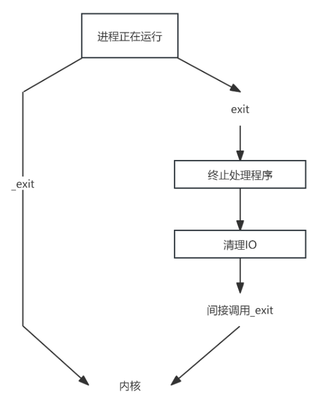

- exit

`_Exit`、`_exit` 和 `exit` 都是用于立即终止进程的函数，但它们在处理进程终止时的行为上有所不同：

当调用 `_exit`和`_Exit`的时候，进程会直接终止返回内核，
而exit函数则会首先执行终止处理程序，然后清理标准IO （就是把所有打开的流执行一次fclose ），最后再终止进程回到内核。

```C
#include <stdlib.h>
void exit(int status);
#include <stdlib.h>
void _Exit(int status);
#include <unistd.h>
void _exit(int status);
```

EgCode:

```C
#include <testfun.h>
void func(){
    //exit(EXIT_SUCCESS);
    //_exit(EXIT_SUCCESS);
    _Exit(EXIT_SUCCESS);
}
int main()
{
    printf(" 123 ");
    func();
    return 0;
}
```

- 信号退出

当进程处于前台的时候，按下ctrl+c或者是ctrl+\可以给整个进程组发送键盘中断信号 SIGINT和SIGQUIT。

- abort

`abort()` 函数是一个标准库函数，用于异常终止当前进程。(`abort` 实际上是通过发送中止信号给当前进程来实现的。)

```C
#include <testfun.h>
int main()
{
    printf("1 \n");
    abort();
    printf("2 \n");
    return 0;
}
```

#### 1.3.3.1 孤儿进程

如果父进程先于子进程退出，则子进程成为孤儿进程，此时将自动被PID为1的进程收养, PID为1的进程就成为了这个进程的父进程。当一个孤儿进程退出以后，它的资源清理会交给它的父进程来处理。

EgCode: 配合`ps -elf`查看

```C
#include <testfun.h>
int main()
{
        if(fork() == 0){
            while(1){
                sleep(1);
            }
        }else{
        }
        return 0;
}
```

#### 1.3.3.2 僵尸进程

如果子进程先退出，系统不会自动清理掉子进程的环境，而必须由父进程调用wait或waitpid函数来完成清理工作，如果父进程不做清理工作，则已经退出的子进程将成为僵尸进程(defunct)，在系统中如果存在的僵尸进程过多，将会影响系统的性能， 所以必须对僵尸进程进行处理。

(当一个进程执行结束时，它会向它的父进程发送一个SIGCHLD/终止信号，从而父进程可以根据子进程的终止情况进行处理。在父进程处理之前，内核必须要在进程队列当中维持已经终止的子进程的PCB。如果僵尸进程过多，将会占据过多的内核态空间。并且僵尸进程的状态无法转换成其他任何进程状态。)

EgCode: 配合`ps -elf`查看

```C
int main()
{
    if(fork() == 0){
    }else{
        while(1){
        }
    }
    return 0;
}
```

#### 1.3.3.3 wait

wait函数的作用是等待一个已经退出的子进程，并进行清理回收子进程资源工作。

- wait 随机地等待一个已经退出的子进程，并返回该子进程的PID, 并给子进程进程资源清理和回收
- wait是一个阻塞函数, wait会一直阻塞直到等到一个结束的子进程, 解除阻塞.(前提是有子进程)(没有子进程的时候, 直接返回-1)

```C
// man 2 wait

#include <sys/types.h>
#include <sys/wait.h>
//wait for process to change state
pid_t wait(
    int *wstatus
);
// 返回值, 成功返回子进程的ID, 失败返回-1
```

### 1.3.4 会话

会话 = 一个终端与 OS 之间的一组交互；打开新终端会新建会话。
会话包含多个进程组，且最多有一个前台进程组（其余为后台进程组）。
控制进程：与控制终端连接的会话首进程；终端输入的中断信号发给前台进程组。
会话 ID 通常等于创建该会话的进程 PID；查询/创建：`getsid(pid)` / `setsid()`（调用 `setsid()` 的进程不能是进程组组长）。
终端断开会向控制进程发送挂断信号，通常导致相关进程组结束。

**终端**
名词概念：用户登录 Linux 的入口设备（本地虚拟控制台或远程终端）。
启动时由 `init` 创建子进程运行 `getty` 再 exec `login`，以打开/等待终端并完成登录。

#### 1.3.4.1 进程组

进程组 = 一个或多个进程的集合；每个进程有 PID 和进程组 ID (PGID)。
shell 启动进程时会创建进程组，组长的 PID 即为该进程组 ID。
fork 创建的子进程默认与父进程同组；只要组内有进程，组就存在。
获取/改变：`getpgrp()` / `setpgid(pid, pgid)`（`pid`或`pgid`为0表示当前进程或用自身PID）。
常见用途：后台/前台作业控制、信号广播到进程组。

**一个信号 可以发给一个前台进程组的所有进程。**

#### 1.3.4.2 守护进程

- 后台长期运行、与终端无关的系统/服务进程（例如日志、监控、服务器）。
- 标准创建流程（守护进程 checklist）：
  1. 父进程 fork 子进程并让父进程退出（脱离控制终端）。
  2. 子进程 调用 `setsid()` 创建新会话并成为会话/进程组领导。
  3. 切换工作目录到根目录（`chdir("/")`），避免占用可卸载文件系统。
  4. 重设 umask（`umask(0)`）以控制文件权限默认值。
  5. 关闭或重定向不需要的文件描述符（通常关闭 0、1、2）。

简化示例：

```c
if (fork() == 0) {
    setsid();
    chdir("/");
    umask(0);
    for (int i = 0; i < 1024; ++i) close(i);
    while (1) sleep(1);
}
```

#### 1.3.4.3 用户组和用户权限


#### 1.3.4.4 前后台进程的区别，如何启动前后台进程

进程组依赖会话存在，如果会话关闭了，前后台进程组都会关闭，而守护进程不依赖于会话存在。
键盘命令无法发给后台进程组，指令信号能发给后台进程组

## 1.4 进程间通信

> 虚拟CPU和虚拟内存的引入保证了进程的隔离性。进程间通信（IPC **Inter-process communication**）用于跨越这种隔离，将数据或事件在多个进程间传递。下文保留原文标题层级，按管道与共享内存等主题展开详细说明与实践建议。

### 1.4.1 管道

管道（pipe）是 Unix/Linux 中常用的进程间通信（IPC）方式之一，本质上是内核维护的一块环形缓冲区，通过文件描述符暴露给进程。一端用于写入数据，另一端用于读取数据，数据按先进先出（FIFO）顺序流动。

管道的特点：

单向流动：数据只能从写端流向读端
节流模型：没有消息边界，由内核自动管理数据流
自带同步：读空管道时阻塞，写满管道时阻塞
引用计数：只有当所有写端都关闭后，读端读取才会返回 EOF

在本节我们覆盖三类常用管道：有名管道（FIFO）、匿名管道（pipe）和 popen 封装。

#### 1.4.1.1 有名管道（FIFO）

有名管道以文件的形式存在于文件系统（通过 mkfifo 创建），但数据通过内核缓冲区传递而非磁盘。适合无亲缘关系进程之间的顺序消息传递。

创建：`mkfifo(pathname, mode)`；删除：`unlink(pathname)`。
优点：易用、按 FIFO 传输；缺点：适合小数据、顺序流。注意打开顺序和阻塞/非阻塞标志（O_NONBLOCK）。

```c
#include <sys/types.h>
#include <sys/stat.h>
int mkfifo(const char *pathname, mode_t mode);
// 返回值: 成功 0, 失败 -1
```

```c
#include <unistd.h>
int unlink(const char *pathname);
// 返回值: 成功 0, 失败 -1
```

示例：

```c
int main(int argc, char *argv[])
{
    mkfifo("myfifo", 0600);
    int fd = open("myfifo", O_RDWR);

    if (fork() == 0) {
        write(fd, "hello", 5);
        sleep(1);
        char buf[6] = {0};
        read(fd, buf, sizeof(buf) - 1);
        printf("child: %s\n", buf);
    } else {
        char buf[6] = {0};
        read(fd, buf, sizeof(buf) - 1);
        printf("parent: %s\n", buf);
        sleep(1);
        write(fd, "ok", 2);
    }
    unlink("myfifo");
    return 0;
}
```

#### 1.4.1.2 匿名管道（pipe）

匿名管道由 `pipe()` 创建，没有文件名，只能通过继承的文件描述符访问，通常用于父子进程之间的通信。

- 特性：半双工，仅限亲缘进程；若需双向通信，创建两条管道或使用 socketpair。
- 使用 `close()` 关闭不需要的端以避免阻塞或触发 SIGPIPE。

```c
#include <unistd.h>
int pipe(int pipefd[2]);
// pipefd[0] 为读端，pipefd[1] 为写端
```

示例：

```c
int main(int argc, char *argv[])
{
    int pipefd[2];
    pipe(pipefd);
    if (fork() == 0) {
        close(pipefd[1]);
        char buf[16] = {0};
        read(pipefd[0], buf, sizeof(buf) - 1);
        printf("child get message: %s\n", buf);
    } else {
        close(pipefd[0]);
        write(pipefd[1], "hello", 5);
        wait(NULL);
    }
    return 0;
}
```

#### 1.4.1.3 popen

`popen()` 封装了 `pipe + fork + dup2`，便于用子进程的 stdin/stdout 做流式交互（读取命令输出或向其写入数据）。控制粒度不及手写 fork/pipe，但代码更简洁。

```c
#include <stdio.h>
FILE *popen(const char *command, const char *type);
// type: "r" 表示读取子进程输出；"w" 表示向子进程输入写入
```

示例（读取命令输出）：

```c
int main()
{
    char buf[1024] = {0};
    FILE *pipe = popen("ls", "r");
    fread(buf, 1, sizeof(buf) - 1, pipe);
    printf("ls:\n%s", buf);
    pclose(pipe);
    return 0;
}
```

### 1.4.2 共享内存

共享内存允许多个进程映射同一片物理内存，适合高吞吐或大数据量场景。Linux 常见实现有 System V 和 POSIX 两种接口。

#### 1.4.2.1 System V 共享内存

key value 数据具有自我描述性

1. 生成 key：`ftok(pathname, proj_id)`。

```c
#include <sys/ipc.h>
key_t ftok(const char *pathname, int proj_id);
```

1. 创建/获取共享内存段：`shmget(key, size, shmflg)`。

```c
#include <sys/shm.h>
int shmget(key_t key, size_t size, int shmflg);
```

1. 映射到进程地址空间：`shmat(shmid, NULL, 0)`。

```c
void *shmat(int shmid, const void *shmaddr, int shmflg);
```

示例：写入和读取共享内存
read()、write() 是文件描述符调用，不能操作共享内存

```c
/* 写 */
int main()
{
    int shmid = shmget(1000, 4096, 0600 | IPC_CREAT);
    char *p = (char *)shmat(shmid, NULL, 0);
    strcpy(p, "hello123");
    return 0;
}
```

```c
/* 读 */
int main()
{
    int shmid = shmget(1000, 4096, 0600 | IPC_CREAT);
    char *p = (char *)shmat(shmid, NULL, 0);
    printf("read: %s\n", p);
    return 0;
}
```

1. 解除和删除：`shmdt(ptr)` 解除映射，`shmctl(shmid, IPC_RMID, NULL)` 标记删除。

```c
int shmdt(const void *shmaddr);
int shmctl(int shmid, int cmd, struct shmid_ds *buf);
```

注意：共享内存本身不提供同步，必须配合信号量或互斥（System V/ POSIX semaphores）或使用原子操作来保护并发写入的临界区。

#### 1.4.2.2 POSIX 共享内存

POSIX 接口使用 `shm_open`、`ftruncate`、`mmap`、`munmap`、`shm_unlink`，更贴近文件描述符语义，名称以 `/name` 形式给出。

```c
#include <sys/mman.h>
#include <fcntl.h>
int shm_fd = shm_open("/test", O_CREAT | O_RDWR, 0666);
ftruncate(shm_fd, 4096);
void *ptr = mmap(NULL, 4096, PROT_READ | PROT_WRITE, MAP_SHARED, shm_fd, 0);
/* 使用 ptr */
munmap(ptr, 4096);
shm_unlink("/test");
```

示例（父子进程通信）：

```c
int main()
{
    int shm_fd = shm_open("/test", O_CREAT | O_RDWR, 0666);
    ftruncate(shm_fd, 4096);
    void *ptr = mmap(NULL, 4096, PROT_READ | PROT_WRITE, MAP_SHARED, shm_fd, 0);
    if (fork() == 0) {
        sprintf((char *)ptr, "Hello from child!");
    } else {
        wait(NULL);
        printf("shared memory: %s\n", (char *)ptr);
    }
    munmap(ptr, 4096);
    shm_unlink("/test");
    return 0;
}
```

#### 1.4.2.3 并发写入与同步

共享内存不提供互斥，多个进程并发写会导致竞态，需要使用信号量（System V 或 POSIX）、互斥量或原子操作来保护临界区。示例（未保护的竞态）仅用于说明：

```c
int main()
{
    int shmid = shmget(100, 4096, 0600 | IPC_CREAT);
    int *p = (int *)shmat(shmid, NULL, 0);
    p[0] = 0;
    if (fork() == 0) {
        for (int i = 0; i < 100000; i++) p[0]++;
    } else {
        for (int i = 0; i < 100000; i++) p[0]++;
        wait(NULL);
        printf("%d\n", p[0]);
    }
    return 0;
}
```

问题总结

该代码的问题是**多进程并发访问共享内存时存在数据竞争**。

1. **非原子操作**：`p[0]++` 分解为 LOAD → ADD → STORE 三条指令，不是原子操作。
2. **CPU 寄存器层面**：两进程各自有独立寄存器，LOAD 读到各自寄存器后 INC，再 STORE 回内存可能互相覆盖，导致一次递增丢失。
3. **操作系统调度**：`fork()` 后父/子进程独立调度，任意指令之间都可能发生上下文切换，时间片交错越频繁，丢失越多。
4. **多核缓存一致性**：两进程运行在不同核时，Store Buffer 和 Invalidate Queue 延迟导致一个核的写入不能立即被另一个核看见，读到的仍是过期值。
5. **编译器优化**：编译器可能将循环提升为寄存器局部累加最后一次性写回内存，从而意外得到 200000（用 `-O0` 或 `volatile` 可避免）。

**正确结果**：实际输出通常在 **10万~20万** 之间，几乎不可能等于理论值 200000。

中断处理程序只是`寄生`在cup处理中断过程中的一段指令程序，它没有进程的存在逻辑（task_struct、虚拟内存等）；

#### 1.4.2.4 工具与调试命令

- `ipcs`：列出 System V IPC 对象。
- `ipcrm -m <shmid>`：删除共享内存段。

### 1.4.3 小结

选择 IPC 时应根据进程关系、数据量与延迟/吞吐需求决定：父子或小消息使用 pipe/popen；跨进程或大数据使用共享内存并配合同步原语；跨主机或复杂语义使用 socket。务必管理好资源清理与同步。

### 1.4.4 信号

#### 1.4.4.1 什么是信号

信号的分类

#### 1.4.4.2 信号在进程task_struct中的存在形式（linux源码）

#### 1.4.4.3 信号与中断的关系

硬中断与软中断

总结：
信号和中断是完全相互独立的: **中断涉及到的是, CPU对紧急事件的处理和响应, 以及进程的调度和上下文切换;**，**而信号则是被某些行为产生, 产生的信号会修改对应进程的状态, 对应的进程, 又根据被改变的进程状态,  做出对应反应。**

#### 1.4.4.4 信号的传递流程

```txt
1. 进程睡眠时能不能感知 signal？
不能立即感知，signal 只是被内核写入 task_struct 的 pending 标志位。
2. sleep 状态的进程在哪里执行？
睡眠进程仍处于内核态，只是被 schedule 挂起不再占用 CPU。
3. signal 是谁写入 task_struct 的？
由当前执行内核代码的上下文（syscall / 中断 / 内核线程）完成，没有独立的 OS 进程。
4. signal 写入是否依赖目标进程运行？
不需要，内核可在目标进程运行、睡眠或未调度时直接修改其 task_struct。
5. signal 写完后立即执行吗？
不会，只是标记，必须等进程进入"返回用户态"或调度安全点才会执行。
6. 为什么不能在 send_signal 里直接执行 handler？
因为内核可能处于持锁 / 调度 / 中断上下文，不能直接切换到用户态执行代码。
7. signal 执行的安全点是什么？
在 return-to-user（从内核返回用户态）或调度返回用户态的安全点执行。
8. B 在 mutex 睡眠时收到 signal 会怎样？
取决于睡眠类型：可中断睡眠会被唤醒并返回，不可中断睡眠必须等锁或资源。
9. mutex 上的 sleep 能被 signal 强制打断吗？
不能强制打断不可中断 mutex，只能在可中断等待或后续调度点生效。
10. A 在 B 运行时能否修改 B 的 signal？
可以，内核通过锁保护允许并发修改 task_struct 的 pending 标志。
11. 修改 signal 是否需要暂停 B？
不需要，通过内核锁 / 原子操作保证并发安全。
12. signal 本质是什么？
内核对 task_struct 的异步标记 + 在安全点对用户态执行流的延迟修改。
13. signal 的真实执行模型是什么？
延迟执行的控制流插入机制，而非即时函数调用。
```

#### 1.4.4.5 信号函数

#### 1.4.4.6 多个信号触发（重要）

在使用函数signal时，如果进程收到一个信号，自然地就会进入信号处理的流程，如果在信号处理的过程中：

- 接受到了另一个不同类型信号。那么当前的信号处理流程是会被中断的， CPU会先转移执行新到来的信号处理流程，执行完毕以后再恢复原来信号的处理流程。
- 接受到了另一个相同类型信号。那么当前的信号处理流程是会不会被中断的， CPU会继续原来的信号处理流程，执行完毕以后再响应新来到的信号。

>这是通过 mask掩码实现的，信号位图存储有哪些信号，另外有一个mask位图用于决定是否屏蔽信号处理。
>当 A 向 B 发送 `2号信号` 时，内核在 send_signal 路径中将 `2号信号` 标记到 B 的 pending 位图中，并根据 B 当前的 blocked mask 决定是否立即递送。若 B 正在执行 `2号信号` 的 handler，内核会自动将 `2号信号` 加入 blocked mask，从而保证 handler 不可重入。新的 `2号信号` 只会被记录在 pending 中而不会打断当前执行流程。当 handler 执行结束返回用户态时，内核恢复之前保存的 mask，并检查 pending 位图，若仍存在 `2号信号`，则再次触发 handler。

- 如果接受到了连续重复的相同类型的信号，后面重复的信号会被忽略，从而该信号处理流程只能再多执行一次。

代码示例

```c
//请在这儿添加示例
```

## 1.5 代码小结

```c
#define _GNU_SOURCE
#include <stdio.h>      // printf, perror
#include <stdlib.h>     // exit, EXIT_SUCCESS
#include <unistd.h>     // fork, pipe, read, write, close, getppid
#include <string.h>     // strncpy
#include <signal.h>     // sigaction, sigemptyset, sigaddset, sigprocmask, sigsuspend, kill
#include <sys/wait.h>   // waitpid
#include <sys/select.h> // select, FD_ZERO, FD_SET, FD_ISSET
#include <sys/time.h>   // struct timeval
#include <sys/shm.h>    // shmget, shmat, shmdt, shmctl
#include <sys/ipc.h>    // IPC_CREAT, IPC_EXCL, IPC_RMID

/* 信号处理函数：收到 SIGUSR1 时仅设置标志，主循环通过 sigsuspend 返回后检查 */
static void func(int s)
{
    printf("%d: receive signal:%d\n", getpid(), s);
}

static void fun(int s)
{
    printf("receive signal %d", s);
    exit(0);
}

int main(void)
{
    // 1. pipe
    int pfd_1[2];
    int pfd_2[2];
    pipe(pfd_1);
    pipe(pfd_2);

    // 2. shared memory
    key_t key_1 = ftok("/tmp", 1);
    key_t key_2 = ftok("/tmp", 2);

    int   sid_1 = shmget(key_1, 64, IPC_CREAT | 0666);
    int   sid_2 = shmget(key_2, 64, IPC_CREAT | 0666);
    char *shm_1 = (char *)shmat(sid_1, NULL, 0);
    char *shm_2 = (char *)shmat(sid_2, NULL, 0);

    // 3. signal setup（必须在 fork 前做）
    sigset_t mask, old;
    sigemptyset(&mask);
    // sigaddset(&mask, SIGUSR1);
    struct sigaction sa;
    memset(&sa, 0, sizeof(sa));
    sa.sa_handler = func;
    sigemptyset(&sa.sa_mask);
    sa.sa_flags = 0;
    sigaction(SIGUSR1, &sa, NULL);

    // 4. fork
    pid_t pid = fork();
    if(pid == 0) {
        /* child */
        signal(2, fun);
        sleep(4);

        close(pfd_1[1]);
        close(pfd_2[0]);

        strncpy(shm_2, "msg1 from son", 63);
        shm_2[63] = '\0';
        write(pfd_2[1], "!", 1);

        /* 等待 parent SIGUSR1 */
        sigsuspend(&old);
        printf("son got SIGUSR1, msg done\n");

        fd_set fds;
        FD_ZERO(&fds);
        FD_SET(pfd_1[0], &fds);
        struct timeval tv  = {.tv_sec = 5, .tv_usec = 0};
        int            ret = select(pfd_1[0] + 1, &fds, NULL, NULL, &tv);
        if(ret > 0 && FD_ISSET(pfd_1[0], &fds)) {
            char c;
            read(pfd_1[0], &c, 1);
            printf("child read: %s\n", shm_1);
            kill(getppid(), SIGUSR1);
        }

        close(pfd_1[0]);
        close(pfd_2[1]);
        exit(EXIT_SUCCESS);
    }

    /* parent */
    close(pfd_1[0]);
    close(pfd_2[1]);

    fd_set fds;
    FD_ZERO(&fds);
    FD_SET(pfd_2[0], &fds);
    struct timeval tv  = {.tv_sec = 5, .tv_usec = 0};
    int            ret = select(pfd_2[0] + 1, &fds, NULL, NULL, &tv);
    if(ret > 0 && FD_ISSET(pfd_2[0], &fds)) {
        char c;
        read(pfd_2[0], &c, 1);
        printf("parent read: %s\n", shm_2);
        kill(pid, SIGUSR1);
    }

    strncpy(shm_1, "msg1 from parent", 63);
    shm_1[63] = '\0';
    write(pfd_1[1], "!", 1);
    sigsuspend(&old);
    printf("parent got SIGUSR1, msg done\n");

    // 5. cleanup
    waitpid(pid, NULL, 0);
    shmdt(shm_1);
    shmdt(shm_2);
    shmctl(sid_1, IPC_RMID, NULL);
    shmctl(sid_2, IPC_RMID, NULL);
    close(pfd_1[1]);
    close(pfd_2[0]);

    return 0;
}
```

## 1.6 线程

### 什么是线程

线程是操作系统能够进行调度和执行的最小单位。它本质上是进程内部的一条执行流，同一进程的多个线程共享地址空间和资源（堆、全局变量、文件描述符等），但拥有独立的栈和寄存器上下文。
可以把线程理解为"轻量级的执行路径"——它让一个程序可以同时做多件事（比如一边接收用户输入，一边后台保存文件），而切换成本比进程低得多。

#### 为什么有线程

| 对比项 | 进程 | 线程 |
| -------- | ------ | ------ |
| 资源归属 | 资源分配的最小单元 | 依赖于进程存在，共享进程的代码段、数据段、堆区、PCB等，只有独立的栈区 |
| 调度单位 | — | CPU调度的最小单元 |
| 通信与切换 | 进程间通信麻烦，切换消耗高 | 线程间数据共享便捷，切换资源消耗低 |
| 崩溃影响 | 进程间崩溃不会影响其他进程 | 线程崩溃会导致其他线程崩溃 |
| task_struct | 每个进程有独立的task_struct | 也有task_struct，但只存栈指针、独有的tid等 |

- 一个进程产生一定伴随一个线程产生，这个线程一般是主线程

#### 使用线程的地方尽量不要使用信号，使用信号的地方尽量不要使用线程（这不是语法规定，只是避免出问题）

#### 用户级线程 与 内核级线程

用户级线程： 由应用程序（线程库）在用户空间管理，内核不知道其存在。线程的创建、切换、调度都在用户态完成，不需要内核参与，切换开销极小。但一个线程阻塞（如I/O）会导致整个进程阻塞，因为内核只认进程。

内核级线程： 由操作系统内核直接创建和管理，每个线程都可被内核独立调度。一个线程阻塞不影响同进程的其他线程，可以利用多核并行。但切换需要进入内核态，开销较大。

当前Linux（NPTL）： 每个用户级线程对应一个内核级线程，兼具两者优点——应用程序层使用用户级接口，内核负责实际调度。
所以它兼具了两者的特性：
拥有内核级线程的优点：独立调度、多核并行、一个线程阻塞不影响其他线程。
拥有用户级编程的便利：API 简单，资源共享方便。

#### 线程的退出

- 线程的退出途径
1、主动退出，执行线程函数的return `返回值`
2、主动退出，线程函数执行pthread_exit(`返回值`)
3、被动退出，其他线程调用pthread_cancel(treadId), 需要退出的线程存在 `取消点函数`，或`手打取消点`pthread_testcancel()，但是没有`返回值`。在被动退出时，如果需要优雅退出，那么需要压栈 `清理函数`，这样在线程被动退出时弹栈`清理函数`就能正常释放线程持有的资源

### 同步互斥

#### 互斥锁

线程加锁的逻辑：
> 判断锁是否处于未锁状态
    - 如果未加锁，线程加锁（获取锁）
    - 否则 让自己陷入阻塞（当锁被别人释放，再重新尝试获取）

#### 死锁

`死锁`（Deadlock）是指多个执行实体因资源分配关系形成循环等待，使每个执行实体都在等待其他执行实体释放其所需资源，从而导致所有相关执行实体均无法继续执行；在系统状态不发生外部改变的情况下，该等待状态将无限持续。

- 导致死锁的原因：
- 避免死锁的方式：

导致死锁的原因，解除死锁的4个途径是什么？
死锁的4个必要条件（Coffman条件）：

- 互斥：资源一次只能给一个进程用
- 持有并等待：进程拿着一些资源，还等着别的资源
- 不可剥夺：别人不能强行抢走你占着的资源
- 循环等待：形成 A等B、B等C、C等A 的环
解除死锁的4个途径：

4个解除途径：

- 预防：破坏上述任一条件。例如要求进程一次性申请所有资源（破坏"持有并等待"），或给资源编号、按序申请（破坏"循环等待"）
- 避免：每次分配前判断是否安全（银行家算法），不安全就不分配
- 检测：由操作系统定期检查是否有循环等待
- 恢复：检测到死锁后，强制终止进程或剥夺资源

#### 读写锁

```c
#include <phtread.h>

pthread_mutex_t lock

pthread_t t_id;
pthread_create(&t_id, NULL, func, NULL);

pthread_mutex_init(&lock, NULL);

pthread_mutex_lock(&lock);
pthread_mutex_unlock(&lock);

```

- 读锁能多个线程共同持有，读锁只能互斥持有

#### 条件变量

```c
#include <pthread.h>
pthread_cond_t cond;
pthread_mutex_t lock;

int pthread_cond_init(&cond, NULL);

int ret = pthread_cond_wait(&cond, &lock);// wait on a condition 

int ret = pthread_cond_signal(&cond);// signal a condition 

```

#### 虚假唤醒

`虚假唤醒`指条件变量在 pthread_cond_broadcast 或 pthread_cond_signal 唤醒多个线程时，被唤醒的线程获得锁后发现自己不满足执行条件，只能重新等待的情况。
以生产者-消费者为例：广播唤醒了 5 个消费者线程，但它们共用一把锁，只有一个能抢到锁。这个线程消费了资源导致条件变化，剩下 4 个线程醒来获取锁后，发现条件已经不满足（资源已被消费），这就是虚假唤醒。
解决办法： 将 if 判断改为 while 循环，被唤醒后重新检查条件：
while (num < 5) {       // 不满足条件就继续等
    pthread_cond_wait(&cond, &lock);
}
这样每次被唤醒后都重新判断条件，不满足则继续等待，避免误执行。

#### 线程安全

ctime() 是线程不安全函数（没有解耦机制，没有锁和同步机制导致线程间数据访问相互影响）
ctime_r() 是线程安全函数

#### 可重入性

同一个函数，相同参数传入，返回的结果一样就是可重入的，如果相同的调用返回结果不一样，意味着之前的调用对后面有影响，就是不可重入的。

- 依赖静态数据，或调用了不可重入函数的函数，基本是不可重入的函数。

#### 进程间的同步互斥

在实际 C/Linux 开发中，进程间确实经常需要同步，但是否使用 pthread_mutex + 共享内存，取决于共享资源是什么：共享文件用文件锁，共享内核对象用内核同步机制，共享内存中的数据结构才使用 pthread_mutex/pthread_cond 配合共享内存。特定的场景有专门的进程互斥方式。

## 网络编程

### 网络协议

数据在网络中传输之所以能传到目的地，是数据在网络的每个层级传输的过程中进行了 头部+下一层的数据 的拆分和重组过程，头部解析决定下一步往哪儿发，下一层的数据 又由 下一层的头部 和 下一层的数据组成。

#### 协议

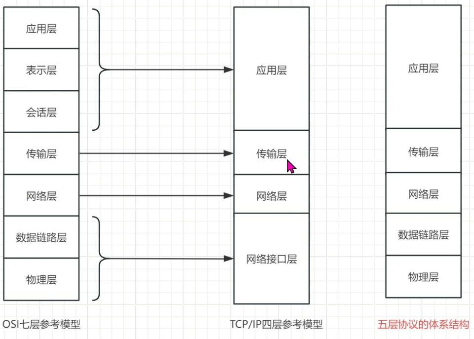

#### HTTP协议

HTTP（HyperText Transfer Protocol）是应用层协议，采用请求-响应模型，通常基于TCP传输，本身是无状态协议。

HTTP请求由请求行、请求头、空行和请求体组成；响应由状态行、响应头、空行和响应体组成。

常见请求方法包括GET、POST、PUT、DELETE，其中GET用于获取资源，POST用于提交资源。GET和POST最本质的区别是语义，而不是参数位置。

HTTP状态码中：
2xx表示成功（200），
3xx表示重定向（301、302、304），
4xx表示客户端错误（400、401、403、404），
5xx表示服务器错误（500、502、503、504）。

HTTP/1.0默认短连接，HTTP/1.1默认Keep-Alive长连接，HTTP/2引入二进制帧、头部压缩和多路复用，HTTP/3基于QUIC（UDP）实现，进一步降低连接建立和队头阻塞带来的开销。

由于HTTP无状态，因此通常结合Cookie、Session或Token实现用户身份认证；浏览器缓存则通过Last-Modified、ETag以及304状态码减少重复传输；HTTPS在HTTP基础上增加TLS，实现数据加密、身份认证和完整性保护。

get 和 post 的区别
get一般用于获取数据
get一般把请求放在url之后
post一般用于提交数据
post一般把请求放在正文里面

#### 抓包 分析能力 （重要）

wieshark 工具

shell指令：tcpdump

#### 加密

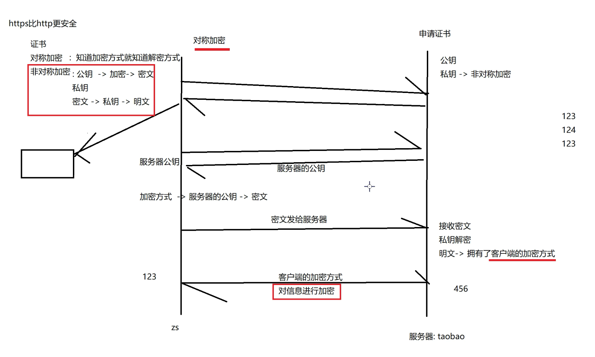

#### TCP协议

tcp报文格式

tcp如何保证可靠：
TCP通过序号（Seq）保证数据有序，通过确认号（ACK）确认数据是否收到，通过超时重传和快速重传解决丢包，通过滑动窗口提高传输效率，通过流量控制避免接收方缓存溢出，通过拥塞控制避免网络拥塞，再结合校验和检测数据是否损坏，从而实现可靠传输。

- 1、确认机制：接收方回复 ACK，告诉发送方哪些数据已收到，确认数据成功到达。

- 2、重传机制：未收到 ACK 或收到 3 个重复 ACK 时重新发送丢失的数据，保证数据最终送达。

- 3、有连接：通过三次握手建立连接、四次挥手释放连接，确保双方都准备好通信且数据完整传输。

- 4、窗口机制：允许连续发送多个数据，无需每发一个都等待 ACK，提高传输效率

- 5、流控控制、拥塞控制：根据接收方处理能力控制发送速度，防止接收方来不及处理。根据网络拥塞情况调整发送速度，避免网络发生拥塞。

#### socket 大小端转换

一般情况，网络存储数据使用大端，计算机存储数据使用小端（低位字节在低地址，高位在高地址）

#### TCP socket 套接字通信

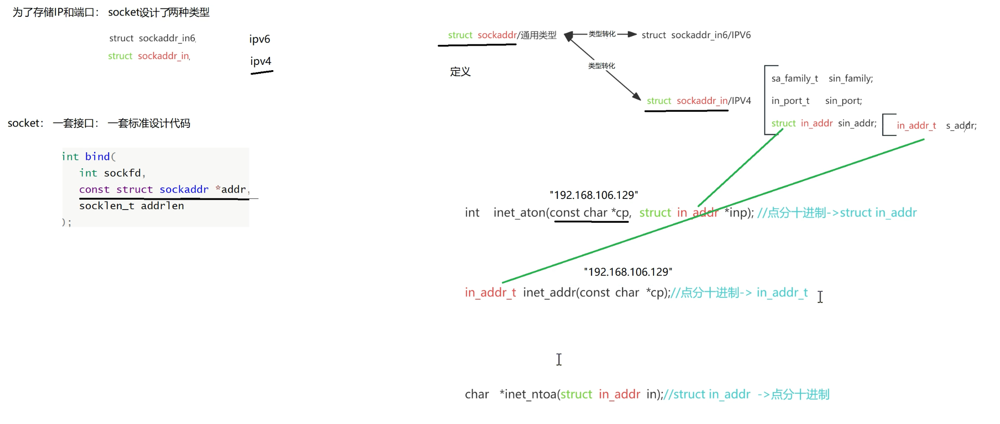

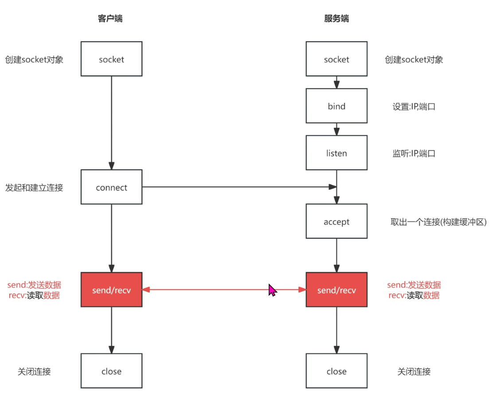

- bind：绑定ip和端口

- listen：3次握手，完成第二次握手会将套接字链接放入内核socket半链接队列中，完成第三次握手会将socket放入全链接队列中

- accept：从全连接队列中获取1个socket信息，然后构建一个一样的socket在内核态

- send/recv：发收信息

- close: 4次挥手

select 群聊

```c
#include <stdio.h> //snprintf
#include <sys/select.h>
#include <sys/socket.h>
#include <stdlib.h>     //stoi
#include <netinet/in.h> //socketaddr_in
#include <arpa/inet.h>  //inet_addr
#include <strings.h>    //bzero
#include <string.h>     //strlen
#include <stdbool.h>    //bool
#include <unistd.h>     //close

struct con {
    int  fd_;
    bool alive;
};

int main()
{
    //socket fd
    int socketFd = socket(AF_INET, SOCK_STREAM, 0);

    //端口复用
    int opt = 1;
    setsockopt(socketFd, SOL_SOCKET, SO_REUSEADDR, &opt, sizeof(opt));

    //address and convert
    struct sockaddr_in socketAd;
    socketAd.sin_family      = AF_INET;
    socketAd.sin_port        = htons(atoi("8081"));
    socketAd.sin_addr.s_addr = inet_addr("192.168.43.132");

    //bind
    bind(socketFd, (struct sockaddr *)&socketAd, sizeof(socketAd));

    //listen
    listen(socketFd, 20);

    //set
    fd_set set, temp;

    //set init
    FD_ZERO(&set);
    FD_ZERO(&temp);

    //FD_SET
    FD_SET(socketFd, &set);

    //con
    struct con list[1024];
    int        pos = 0;
    bzero(list, sizeof(list));

    while(1) {
        printf("start 。。。\n");
        //copy set to temp
        memcpy(&temp, &set, sizeof(set));

        //select
        int ret = select(100, &temp, NULL, NULL, NULL);

        //accept
        if(FD_ISSET(socketFd, &temp)) {
            int conFd = accept(socketFd, NULL, NULL);

            send(conFd, &conFd, sizeof(int), 0);
            printf("new connetcion ...\n");
            for(int i = 0; i < 1024; ++i) {
                if(!list[i].alive) {

                    list[i].fd_   = conFd;
                    list[i].alive = true;
                    if(i > pos) {
                        pos = i;
                    }
                    printf("cur i == %d, pos == %d\n", i, pos);
                    break;
                }
            }
            FD_SET(conFd, &set);
        }

        for(int i = 0; i <= pos; ++i) {
            if(list[i].alive && FD_ISSET(list[i].fd_, &temp)) {
                printf("new msg ... from:%d\n", list[i].fd_);
                char buf[60] = {0};
                int  ret     = recv(list[i].fd_, buf, sizeof(buf), MSG_WAITALL);
                if(ret == 0) {
                    list[i].alive = false;
                    close(list[i].fd_);
                    FD_CLR(list[i].fd_, &set);
                    continue;
                }

                for(int j = 0; j <= pos; ++j) {
                    if(j != i && list[j].alive) {
                        char msg[70] = {0};
                        snprintf(msg, sizeof(msg), "client%d:%s", list[i].fd_, buf);
                        int ret = send(list[j].fd_, msg, strlen(msg), 0);
                    }
                }
            }
        }
    }

    //close
    close(socketFd);

    return 0;
}

```

```c
#include <stdio.h>
#include <stdlib.h>
#include <unistd.h>
#include <sys/socket.h>
#include <netinet/in.h>
#include <arpa/inet.h>
#include <sys/select.h>

int main(int argc, char *argv[])
{
    char *port = "8081";
    char *ip   = "192.168.43.132";

    int socket_fd = socket(AF_INET, SOCK_STREAM, 0);

    struct sockaddr_in sockaddr;
    sockaddr.sin_family      = AF_INET;
    sockaddr.sin_port        = htons(atoi(port));
    sockaddr.sin_addr.s_addr = inet_addr(ip);

    connect(socket_fd, (struct sockaddr *)&sockaddr, sizeof(sockaddr));

    int  num  = 0;
    int *pNum = &num;
    recv(socket_fd, pNum, sizeof(int), 0);
    printf("------ l am client%d ------\n", num);

    fd_set set;
    FD_ZERO(&set);

    while(1) {
        // printf("me %d:", num);
        FD_SET(STDIN_FILENO, &set);
        FD_SET(socket_fd, &set);

        select(10, &set, NULL, NULL, NULL);

        if(FD_ISSET(STDIN_FILENO, &set)) {
            char buf[60] = {0};
            read(STDIN_FILENO, buf, sizeof(buf));
            send(socket_fd, buf, sizeof(buf), 0);
        }

        if(FD_ISSET(socket_fd, &set)) {
            char buf[70] = {0};
            int ret = recv(socket_fd, buf, sizeof(buf), 0);
            if(ret == 0) {
                printf("服务器断开链接 \n");
                break;
            }
            printf("%s \n", buf);
        }
    }

    close(socket_fd);
    return 0;
}

```

#### UDP socket 套接字通信

### epoll

#### epoll 群聊代码

```c
//epoll 群聊
#include <stdio.h>
#include <sys/epoll.h>
#include <unistd.h> //close
#include <sys/socket.h>
#include <stdlib.h>     //stoi
#include <netinet/in.h> //socketaddr_in
#include <arpa/inet.h>  //inet_addr
#include <strings.h>    //bzero
#include <string.h>     //strlen
#include <stdbool.h>    //bool

struct con {
    int  fd_;
    bool alive;
};

int main()
{
    //address
    struct sockaddr_in ipv4Addr;
    ipv4Addr.sin_family      = AF_INET;
    ipv4Addr.sin_port        = htons(atoi("8888"));
    ipv4Addr.sin_addr.s_addr = inet_addr("192.168.43.132");

    //socket
    int sockFd = socket(AF_INET, SOCK_STREAM, 0);

    //bind
    bind(sockFd, (struct sockaddr *)&ipv4Addr, sizeof(ipv4Addr));

    //listen
    listen(sockFd, 20);

    //epoll create
    int epollFd = epoll_create(1); // 1 no mine

    //epoll event
    struct epoll_event sockEvent;
    sockEvent.data.fd = sockFd;
    sockEvent.events  = EPOLLIN; //what's mine

    //epoll ctl
    epoll_ctl(epollFd, EPOLL_CTL_ADD, sockFd, &sockEvent);

    //con list
    struct con conList[1024];
    memset(conList, 0, sizeof(conList));
    int pos = 0;

    while(1) {
        sleep(1);
        printf("start...\n");

        //create input of epoll_wait
        struct epoll_event eventList[5];
        memset(eventList, 0, sizeof(eventList));

        //epoll wait
        int num = epoll_wait(epollFd, eventList, 5, -1); // what't -1 mine

        //reverse event
        for(int i = 0; i < num; ++i) {

            struct epoll_event curEvent = eventList[i];

            if(curEvent.data.fd == sockFd) {
                //new connect
                printf("new connect\n");
                int newConFd = accept(sockFd, NULL, NULL);
                for(int i = 0; i < 1024; ++i) {
                    if(!conList[i].alive) {
                        conList[i].alive = true;
                        conList[i].fd_   = newConFd;
                        if(i > pos) {
                            pos = i;
                        }
                        break;
                    }
                }

                struct epoll_event newConEvent;
                newConEvent.data.fd = newConFd;
                newConEvent.events  = EPOLLIN;
                epoll_ctl(epollFd, EPOLL_CTL_ADD, newConFd, &newConEvent);

            } else {
                // new msg
                printf("new msg\n");
                char buf[60] = {0};
                int  ret     = recv(eventList[i].data.fd, buf, sizeof(buf), MSG_WAITALL);
                if(ret == 0) {
                    for(int j = 0; j <= pos; ++j) {
                        if(eventList[i].data.fd == conList[j].fd_ && conList[j].alive) {
                            epoll_ctl(epollFd, EPOLL_CTL_DEL, curEvent.data.fd, NULL);
                            conList[j].alive = false;
                            close(conList[j].fd_);
                            break;
                        }
                    }
                    continue;
                }

                // for() send
                for(int j = 0; j <= pos; ++j) {
                    if(eventList[i].data.fd == conList[j].fd_ || !conList[j].alive) {
                        continue;
                    }
                    char msg[70] = {0};
                    snprintf(msg, sizeof(msg), "client%d:%s", conList[j].fd_, buf);
                    int ret = send(conList[j].fd_, msg, strlen(msg), 0);
                }
            }
        }
    }

    // close(1);
    return 0;
}
```

```c
#include <stdio.h>
#include <string.h>
#include <sys/epoll.h>
#include <sys/socket.h>
#include <unistd.h> //close
#include <stdbool.h>
#include <arpa/inet.h>
#include <netinet/in.h>
#include <stdlib.h> //stoi

int main()
{
    //address
    struct sockaddr_in ipv4Addr;
    ipv4Addr.sin_family      = AF_INET;
    ipv4Addr.sin_port        = htons(atoi("8888"));
    ipv4Addr.sin_addr.s_addr = inet_addr("192.168.43.132");

    //socket
    int sockFd = socket(AF_INET, SOCK_STREAM, 0);

    // //bind /* client 不能bind ！！！ 不然会一直socket就绪*/
    // bind(sockFd, (struct sockaddr *)&ipv4Addr, sizeof(ipv4Addr));

    //connet
    connect(sockFd, (struct sockaddr *)&ipv4Addr, sizeof(ipv4Addr));

    //epoll_create
    int epollFd = epoll_create(1);

    //epoll event bind socketFd
    struct epoll_event sockEvent;
    sockEvent.data.fd = sockFd;
    sockEvent.events  = EPOLLIN;
    epoll_ctl(epollFd, EPOLL_CTL_ADD, sockFd, &sockEvent);

    //epoll event bind STDIN_FILENO
    struct epoll_event stdInEvent;
    stdInEvent.data.fd = STDIN_FILENO;
    stdInEvent.events  = EPOLLIN;
    epoll_ctl(epollFd, EPOLL_CTL_ADD, STDIN_FILENO, &stdInEvent);

    bool closeFlag = false;

    while(1) {

        //epoll_wait
        sleep(1);
        struct epoll_event eventList[5];
        int                num = epoll_wait(epollFd, eventList, 5, -1);
        printf("epoll hit...\n");

        for(int i = 0; i < num; ++i) {
            printf("for in loop...\n");

            if(eventList[i].data.fd == STDIN_FILENO) {
                //send msg
                printf("send msg\n");
                char buf[60] = {0};
                read(STDIN_FILENO, buf, sizeof(buf));
                send(sockFd, buf, sizeof(buf), 0);
            } else if(eventList[i].data.fd == sockFd) {
                // receive msg
                printf("receive msg\n");
                char msg[70] = {0};
                int  ret     = recv(sockFd, msg, sizeof(msg), 0);
                if(ret == 0) {
                    printf("server closed...\n");
                    closeFlag = true;
                    break;
                }
                printf("%s\n", msg);
            }
        }

        if(closeFlag) {
            break;
        }
    }

    close(sockFd);
    epoll_ctl(epollFd, EPOLL_CTL_DEL, sockFd, 0);
    epoll_ctl(epollFd, EPOLL_CTL_DEL, STDIN_FILENO, 0);
    return 0;
}
```

#### epoll 水平触发、边缘触发

- 水平触发：只要缓冲区、文件等可读，就触发就绪

- 边缘触发：数据变化的时候就触发就绪

#### 面试点（重要）

select 的缺陷有哪些？

你可以答：

select 的主要缺陷有 4 个：

- 监听 fd 数量有限，通常受 FD_SETSIZE 限制，常见是 1024；
- 每次调用都要把 fd 集合从用户态拷贝到内核态；
- 返回后用户态需要遍历所有 fd 找就绪项，复杂度是 O(n)；
- select 会修改传入的 fd_set，所以下一轮必须重新 FD_ZERO / FD_SET 重建监听集合。
因此在高并发、大量长连接场景下性能和扩展性都比较差。

epoll 相对 select 的优点是什么？
你可以答：

epoll 的核心优势在于它采用事件驱动模型：

- 没有 select 那种 1024 的固定 fd 上限；
- fd 只需要通过 epoll_ctl 注册一次，不需要每次 wait 都重新传整批 fd；
- epoll_wait 直接返回就绪事件列表，不需要像 select 那样遍历所有 fd，因此效率更高；
- 内核维护就绪队列，性能更接近 O(活跃连接数)；
- 支持 LT 和 ET 两种触发模式，更适合高并发网络服务器。

### 进程池

进程池设计 适合CPU任务密集形
线程池设计 适合IO密集形

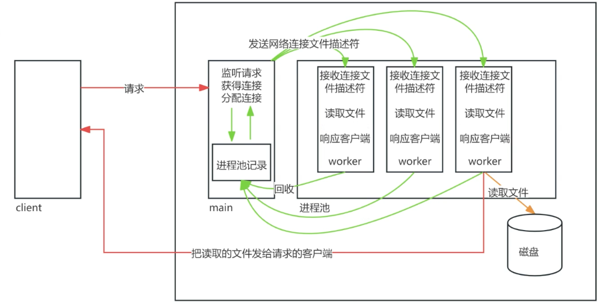

项目：一般都需要将控制部分和实现某个功能的部分进行解耦

本地socket：父子进程间进行socket通信，用于拷贝数据

#### TCP 粘包和半包问题

- 粘包：两次数据因为没有数据边界，被当做一次数据在网络上发送
解决方式：使用协议的逻辑发送数据，加上头部信息，描述数据长度信息，先发描述数据长度的头部信息，再发数据；同样的，客户端也先接收头部信息，再获取了数据长度相关的头部信息之后，再接收数据长度 大小的有效数据。

- 半包：一次数据在发送到对端后，因为底层发送机制被两次发送后，对端解读成两次数据
解决方式：recv函数 recv(netFd, buff, len, MSG_WAITALL) 加上MSG_WAITALL宏，表示只有读到len长度数据或对端关闭才返回。

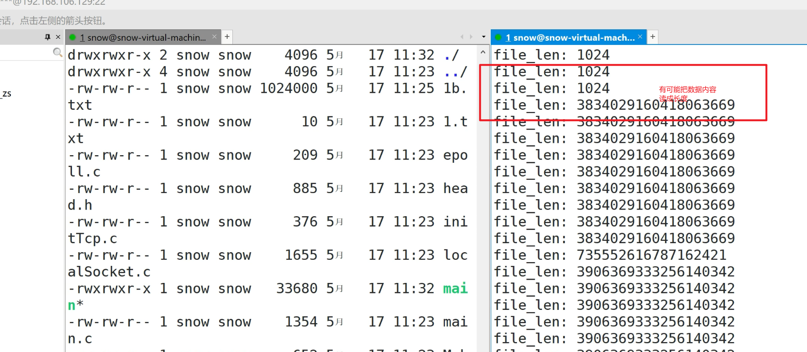
可能是第一次将1024ab 发给了客户端，客户端缓冲区就数据 1024 和ab。第一次recv(int),就是1024 长度，第二次recv（ab）没有读到1024个字节就返回了，结果第三次recv(int)计算长度时，缓冲区中的不是长度，而是内容cdefg... ，就把内容当成了长度。

UDP没有这两个问题，为什么呢？

UDP是面向数据报的协议，每个数据报都是独立的，内核保留消息边界，因此接收方一次 recvfrom() 对应一个完整的数据报, 不会将收到的udp报文放在一起（若缓冲区过小则可能被截断，但不会与其他数据报合并）。

#### recv/send 阻塞与返回条件

recv()

**阻塞模式：**

| 条件 | 行为 |
| ------ | ------ |
| 接收缓冲区有数据 | 立即返回数据（长度 ≤ 请求长度） |
| 缓冲区空，连接正常 | 阻塞直到数据到达 |
| 对端关闭 (FIN)，缓冲区有数据 | 返回数据 |
| 对端关闭 (FIN)，缓冲区空 | 返回 0 (EOF) |
| 对端重置 (RST) | 返回 -1，errno = ECONNRESET |
| 被信号中断 | 返回 -1，errno = EINTR |
| 超时 (SO_RCVTIMEO) | 返回 -1，errno = EAGAIN/EWOULDBLOCK |

**非阻塞模式：**

- 有数据 → 返回数据
- 无数据 → 返回 -1，errno = EAGAIN/EWOULDBLOCK
- 对端关闭 → 同阻塞模式（返回 0 或 ECONNRESET）

send()

**阻塞模式：**

| 条件 | 行为 |
| ------ | ------ |
| 发送缓冲区有空间 | 拷贝数据到内核缓冲区，返回发送的字节数 |
| 缓冲区满 | 阻塞直到有空间 |
| 对端关闭 | 返回 -1，errno = EPIPE（同时触发 SIGPIPE）触发进程死亡 |
| 对端 RST | 返回 -1，errno = ECONNRESET |
| 被信号中断 | 返回 -1，errno = EINTR |
| 超时 (SO_SNDTIMEO) | 返回 -1，errno = EAGAIN/EWOULDBLOCK |

针对send时对端关闭的情况，在最后的参数加入MSG_NOSIGNAL，如果对端断开后 让进程不发送SIGPIPE信号。

**非阻塞模式：**

- 缓冲区有空间 → 拷贝尽可能多的数据，返回实际发送字节数（可能部分发送）
- 缓冲区满 → 返回 -1，errno = EAGAIN/EWOULDBLOCK

关键区别

| 函数 | 对端关闭时的返回值 |
| ------ | ------ |
| recv | 返回 0（优雅关闭，EOF） |
| send | 返回 -1，errno = EPIPE（同时触发 SIGPIPE） |

- recv 返回 0 表示对端优雅关闭，是正常结束信号
- send 返回 EPIPE 表示对端已关闭，写入已无意义

#### 零拷贝

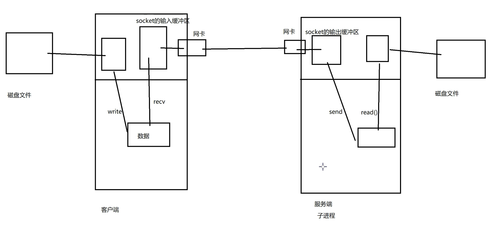

```c
int sendFile(int net_fd){
    char *file_name = "1b.txt";
    // 打开文件
    int file_fd = open(file_name, O_RDWR);
    // 获得文件信息
    struct stat st;
    memset(&st, 0, sizeof(st));
    fstat(file_fd, &st);
    
    //printf("file_size: %ld \n", st.st_size);
    off_t file_size = st.st_size;
    send(net_fd, &file_size, sizeof(off_t), MSG_NOSIGNAL);
    
    // 写给客户端文件名字
    int name_len = strlen(file_name);
    send(net_fd, &name_len, sizeof(int), MSG_NOSIGNAL);
    send(net_fd, file_name, name_len, MSG_NOSIGNAL);

    // 循环读取文件内容, 循环发送
    while(1){
        // 读取文件内容
        char buf[1024] = {0};
        ssize_t file_len = read(file_fd, buf, sizeof(buf));
        if(file_len == 0){
            printf("文件读完 \n");
            break;
        }

        int ret = send(net_fd, &file_len, sizeof(ssize_t), MSG_NOSIGNAL);
        if(ret == -1){
            printf("对方断开链接 \n");
            break;
        }
        // 文件内容: 发送给客户端
        ret = send(net_fd, buf, file_len, MSG_NOSIGNAL);
        if(ret == -1){
            printf("对方断开链接 \n");
            break;
        }
    }

    return 0;
}
```

mmap函数做磁盘到虚拟内存的映射，减少拷贝次数的
mmap参数中的offset 必须是页（4096KB）的倍数
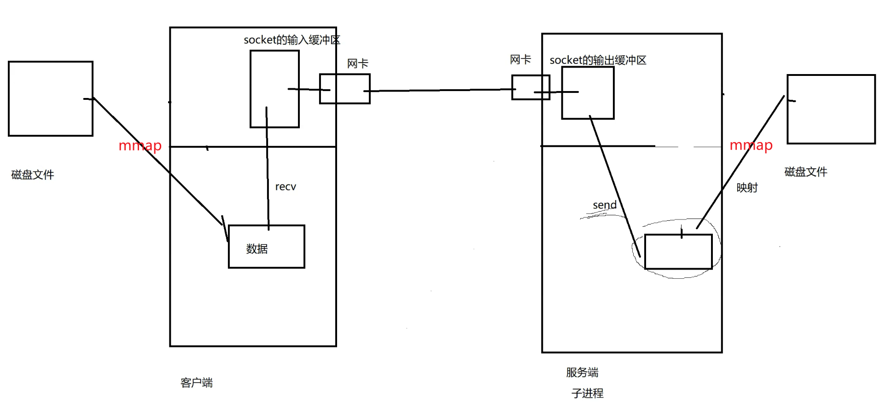

改成mmap

```c
int sendFile(int net_fd){ //写端
    //同上
    //原来的 while(1)循环发送 不需要了

    // mmap映射磁盘文件
    void *p = mmap(NULL, st.st_size,  PROT_READ|PROT_WRITE, MAP_SHARED, file_fd, 0);
    printf("st_size: %d \n", st.st_size);
    send(net_fd, p, st.st_size, MSG_NOSIGNAL);
    munmap(p, st.st_size); // 解除映射
    return 0;
}

void recvFun{ //收端
    //...

    // mmap
    // 修改文件大小
    ftruncate(file_fd, file_size);
    void *p = mmap(NULL, file_size,  PROT_READ|PROT_WRITE, MAP_SHARED, file_fd, 0);
    recv(net_fd, p, file_size, MSG_WAITALL);
    munmap(p, file_size);

    //...
}
```

`sendfile` 实现零拷贝
接收端没有 recvfile，接收端用`mmap`就好了。

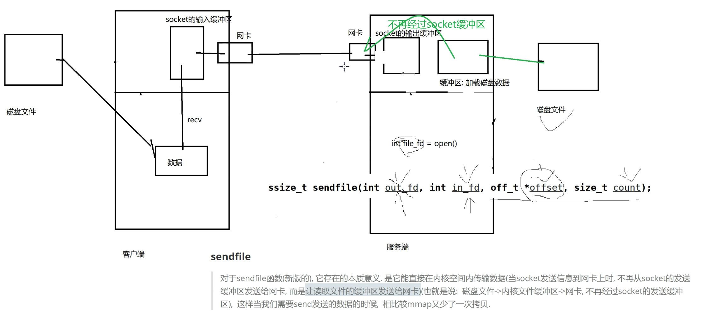

```c
int sendFile(int net_fd){
    //... 同上

    // 使用sendfile发数据 替换while(1) 部分
    sendfile(net_fd, file_fd, 0, st.st_size);

    close(file_fd);
    return 0;
}
```

#### 写的send file bug
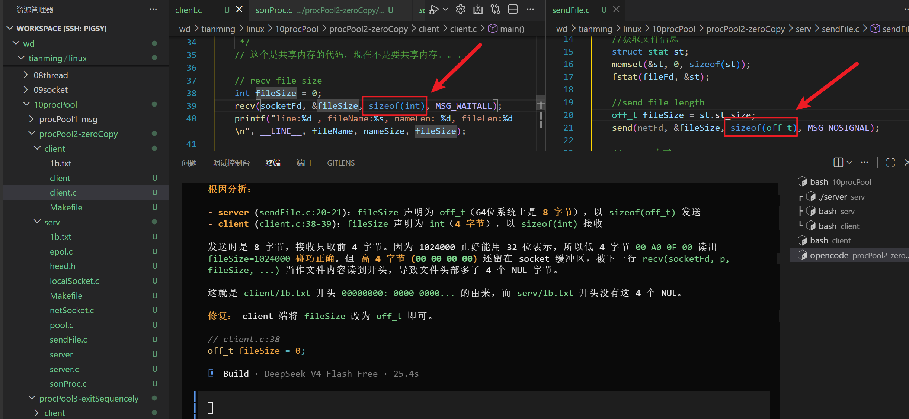

#### 有序退出

参考 `1.3.4会话` 相关的内容， **一个信号 可以发给一个前台进程组的所有进程。**
在带控制终端的 Linux 程序中，终端产生的 SIGINT 等作业控制信号会发送给前台进程组中的所有进程。若父进程希望统一控制多个子进程的退出流程，避免子进程同时异步处理终端信号，可通过 `setpgid() / setsid()` 调整进程组关系，使子进程不再与父进程处于同一前台进程组。这样终端信号主要由父进程处理，再由父进程通过 IPC 或自定义通知机制协调子进程完成任务收尾、资源释放和退出，实现整个服务的有序退出。

当然，如果不采取修改过进程组的方式，也可以让子进程拥有直接处理 SIGINT / SIGTERM的逻辑，也可以实现有序退出。

# 2、C++ base

## C++与C

介绍C++基本语法，与C的写法做对比**（基础）**

### 命名空间

#### 什么是命名空间 为什么需要命名空间

命名空间是 C++ 提供的一种名字隔离机制，用来把变量、函数、类等标识符放到不同作用域中，避免大型项目中的命名冲突。

C 语言没有命名空间，通常只能通过函数名前缀或者 static 来规避重名问题；而 C++ 可以通过 namespace 对代码进行逻辑分组，例如 A::func()、B::func()，即使函数同名也不会冲突。

#### 命名空间的三种使用方式

命名空间常见使用方式有三种：

- 命名空间名::成员名
- using namespace 命名空间名;
- using 命名空间名::成员名;

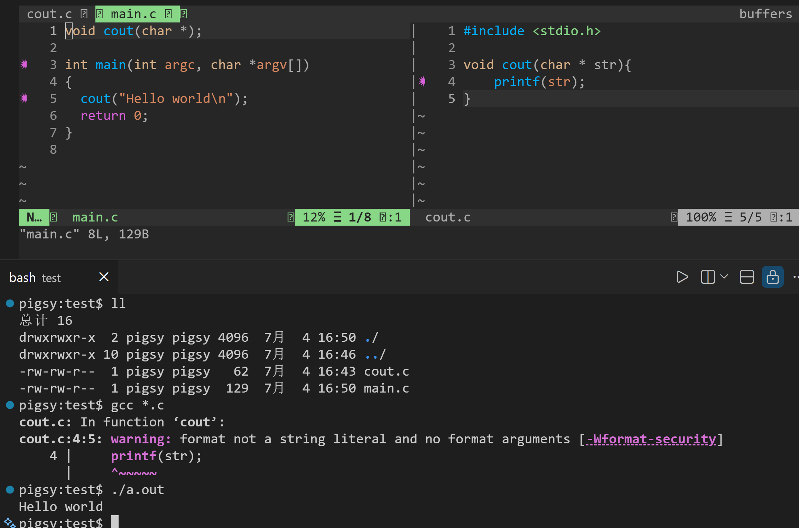

## 类与对象

面向对象思想的介绍，类的基本使用<font color=red>**（重点）**</font>

## C++输入输出流

C++基本输入输出方式 **（基础）**

## 日志系统

log4cpp工具的使用（后续项目会用，对类与对象基础的综合考察）

## 运算符重载

C++特色语法，提供强大且灵活的特性 <font color=red>**（重点）**</font>

## 关联式容器

STL容器的使用 （很常用的标准库工具）

## 继承

不涉及多态的继承，面向对象的基本特征之一 （简单）

## 多态

面向对象的基本特征之一，虚函数机制、虚拟继承、内存布局 <span style=color:red;background:yellow>**（重难点）**</span>

## 模板

模板的简单使用 （深入研究很难，本课程中能够进行简单使用，能够看懂基本的模板代码即可）

## 移动语义与资源管理

学习C++对于右值的处理方式，学习智能指针的使用和注意事项<span style=color:red;background:yellow>**（常用且常考，重点）**</span>

# 3、C++ boost

## 三合成原则
